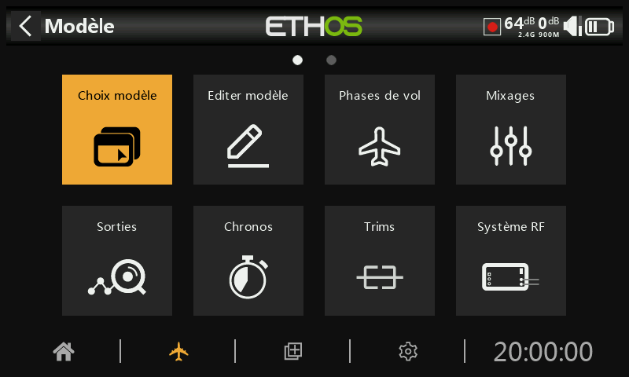

# Configuration du modèle

Un appui sur l'icône avion en bas de l'écran permet la configuration spécifique à chaque modèle. Voici une description succinte des fonctions accessibles.
Chaque section est décrite précisemment par la suite.

#### Aperçu

2 pages sont disponibles pour configurer chaque modèle, en balayant l'écran de droite à gauche et inversement, ou en utilisant le sélecteur rotatif.

**Choix modèle**

La liste des modèles par catégorie s'affiche avec leurs images si ces dernières ont été configurées dans "Editer modèle" et que le fichier .BMP se trouve sur la carte SD.
En sélectionnant un modèle, plusieurs options sont disponibles : sélectionner, dupliquer, déplacer, récevoir / envoyer en BT , ou supprimer des modèles. Il est également utilisé pour créer et gérer des catégories de modèles définies par l'utilisateur.

**Editer modèle**

Modification des paramètres de base du modèle tels que configurés par l'assistant, ainsi que différentes options spécifiques au modèle.

**Phases de vol**

Les phases de vol permettent de configurer les modèles pour des tâches spécifiques ou un comportement de vol sélectionnables par inter. Par exemple, les planeurs peuvent être configurés pour avoir des phases de vol tels que le décollage, la croisière, la vitesse et le thermique. Les avions à moteur peuvent avoir des phases de vol pour le vol normal, le décollage et l'atterrissage. Les hélicoptères ont des phases telles que Normal pour la translation et le décollage/atterrissage, Idle Up 1 pour le vol acrobatique et Idle Up 2 pour peut-être 3D.

**Mixages**

Les mixages définissent les fonctions entre les sources (entrées) et les sorties. En fonction du type de modèle, un choix spécifique de mixages est proposé.
D'autres fonctions sont accessibles : courses différentes selon la position d'un inter, décalages, courbes (exponentiel, différentiel, perso, etc..), etc..

**Sorties**

Visualisation des effets des mixages sur les sorties en fonction du déplacement de la commande ou des trims.
Configuration électronique des neutres / limites mécaniques / sens de déplacement / courbes pour chaque sortie.
8 pages sont disponibles en glissant les écrans soit 64 voies.

**Chronos**

Configuration jusqu'à 8 chronos par modèle.

**Trims**

Configuration la plage de trim et ainsi que du pas de trim pour chaque voie trimmable. Accès à toutes les fonctions de transfert de trim vers subtrim, de trim instantané, etc. Les accès aux trims supplémentaires disponibles pour certaines radios.

**Système RF**

Configuration du système RF pour chaque modèle. Enregistrement de l'ID du propriétaire permettant une identification unique de l'émetteur. Appairage de/des récepteurs, test de portée, etc...  

**Télémétrie**

Configuration et découvertes des capteurs de télémétrie. Activation / Désactivation du mode compétition.

**Checklist**

Définition des positions des différents inters / potentiomètres, position du manche des gaz, etc.. afin de s'assurer d'avoir l'ensemble de la radio correctement configurée avant l'alimentation du récepteur. Chaque modèle possède sa propre checklist.

**Inters logiques**

Les inters logiques sont des inters virtuels programmés par l'utilisateur. Ils sont activés et désactivés en fonction de conditions. Ils peuvent utiliser une variété d'entrées telles que des inters physiques, d'autres inters logiques et d'autres sources telles que des valeurs de télémétrie, des valeurs de voie, de chrono ou des variables. Ils peuvent même utiliser les valeurs renvoyées par un script de modèle LUA.

**Fonctions**

Les fonctions spéciales, qui peuvent être globales à tous les modèles avec une option, permettent d'activer différentes actions telles que la lecture de fichier audio, la lecture de valeurs de télémétrie, l'enregistrement des données, la lecture du vario, etc..

**Courbes**

Les courbes personnalisées peuvent être appliquées sur des entrées, des mixages ou des sorties. 50 courbes sont possibles, et peuvent être de plusieurs types (entre 2 et 21 points, avec des coordonnées x fixes ou définissables par l'utilisateur).

**Vars**

Les variables (Vars) sont utilisées afin de faciliter les réglages d'un modèle en vol. Elles sont modifiables par différentes actions ( trim / Potentiomètre / etc. ) . Une fois les valeurs satisfasantes, Les paramètres peuvent être remplacer par la valeur de la VAR. Cela permet d'éviter systémaiquement de se poser afin de changer une valeur et recommencer.

**Ecolage**

La section Ecolage est utilisée pour définir la radio en tant que maître ou élève dans une configuration d'entraînement. La liaison avec le trainer peut se faire via Bluetooth entre 2 radios FrSky équipées ou via un câble. Voir aussi la possibilité d'écolage inversé avec 2 radios FrSky

**Lua**

Cette page permet de gérer les sources et les tâches Lua par modèle.
