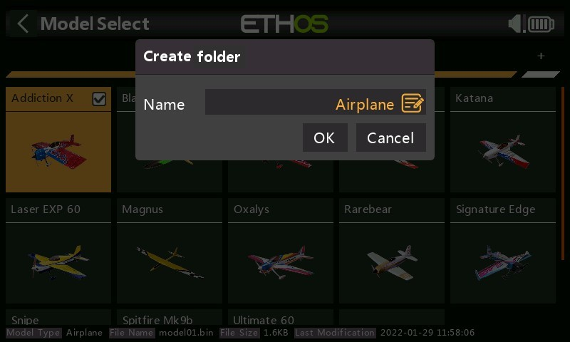
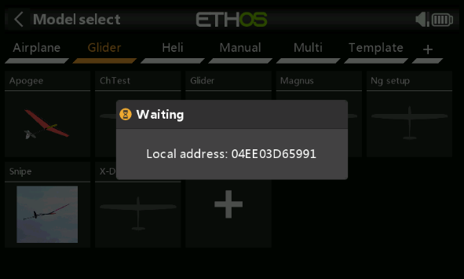

## Choix modèle

L'option de sélection du modèle est accessible en sélectionnant « Choix modèle » dans le menu Modèle. Il permet de sélectionner le modèle actuel, d'ajouter un nouveau modèle, de le cloner ou de le supprimer.

### Gestion des dossiers de modèles

Ethos vous permet de créer vos propres dossiers pour trier et regrouper vos modèles. 
Chaque nouveau modèle crée, reçu, ou stocké dans le répertoire /models de la carte SD ou eMMC sera stocké dans le dossier "non trié". Ethos supprime automatiquement ce dernier quand il est vide.

.jpeg>)

Pour créer un dossier, appuyez [+] » en aut à droite. Entrez le nom dans la boîte de dialogue « Créer nouveau dossier », puis appuyez sur OK. Les noms peuvent comporter jusqu'à 15 caractères. Répétez l'opération pour vos autres dossiers.

NB: ces dossiers apparaissent sous forme de sous-répertoires sous le répertoire \models sur la carte SD ou eMMC, selon la radio.

Les dossiers sont triés par ordre alphabétique, hormis le dossier « Non trié », toujours en dernier dans la liste.

.jpeg>)

Un appui sur le nom de dossier fait apparaitre une boite de dialogue afin de renommer, supprimer un dossier. Si des modèles étaient toujours présents dans le dossier supprimé Ethos les déplace automatiquement dans "Non trié".

### Déplacement d'un modèle vers un autre dossier

Pour déplacer un modèle vers un autre dossier, appuyez sur l'icône du modèle, puis sélectionnez « Déplacer » dans la boîte de dialogue.

Choisissez le dossier cible.

### Ajout d'un nouveau modèle

Pour créer un nouveau modèle, sélectionnez la catégorie de modèle sous laquelle vous souhaitez créer le modèle, puis appuyez sur l'icône [+] pour créer un nouveau modèle ou pour recevoir un modèle d'une autre radio Ethos via Bluetooth.

.png>)

Appuyez sur l'icône [+] pour lancer l'assistant « Créer modèle ». (Vous devrez peut-être d'abord créer vos catégories de modèles, voir ci-dessus.)

.jpeg>)

Choisissez le type de modèle que vous souhaitez créer et suivez les instructions.

Il existe des assistants pour :

* Avion
* Planeur
* Hélicoptère
* Multirotor
* Autre

Les assistants vous guident dans la configuration de base pour un type de modèle donné. 

NB: un nom de modèle peut comporter jusqu'à 15 caractères.

Les assistants incluent la configuration optionnelle de mixages prédéfinis pour les récepteurs stabilisés FrSky. Dans ce cas, les voies
pour le contrôle des modes de stabilisation seront automatiquement ajoutées.

NB : Une configuration Elevon peut être réalisée en créant un nouveau modèle d'avion avec 2 ailerons et pas d'empennage. Les courses de mixage par défaut sont de 50 % sur chacune des commandes. Les courses pourront être adaptées à votre modèle.

.jpeg>)

Le modèle créé apparaîtra dans le dossier de catégorie de modèle défini par l'utilisateur qui était actif au démarrage de l'assistant et sera trié par ordre alphabétique.

### Réception d'un modèle depuis une autre radio Ethos

Pour recevoir un modèle, sélectionnez la catégorie de modèle dans laquelle vous souhaitez créer le modèle, puis appuyez sur l'icône [+].

Appuyez sur « Recevoir » pour lancer le processus de réception d'un modèle d'une autre radio Ethos via Bluetooth.

Votre radio passera en mode d'attente et affichera également son adresse Bluetooth locale pour permettre l'identification de l'adresse correcte sur la radio "émetteur".

\
Sur la radio "émetteur" , appuyez sur l'icône du modèle et sélectionnez « Envoyer » pour débuter le transfert.

\
La radio réceptrice annoncera le fichier modèle sur le point d'être reçu pour confirmation. Appuyez sur Oui pour recevoir le modèle.

### Sélection d'un modèle

Appuyez sur « Choix modèle » pour afficher une liste de vos modèles.

Veuillez noter qu'après une mise à niveau de la version d'Ethos, ETHOS convertit les modèles individuellement lorsqu'ils sont sélectionnés avec l'écran de sélection des modèles. Il n'est pas nécessaire de sélectionner chaque modèle après une mise à jour car la conversion peut avoir lieu à une date ultérieure lorsqu'ils sont sélectionnés, même avec une version ultérieure d'Ethos. Il n'y a pas de retard notable dans le processus de conversion lorsqu'un modèle est sélectionné. Lorsque la conversion a lieu, la date de dernière modification en bas de l'écran de sélection du modèle passe à la date du jour. Si aucune conversion n'est nécessaire, la date ne change que si vous apportez une modification au modèle.

NB: il est conseillé d'effectuer une sauvegarde avec Suite avant une mise à jour afin de pouvoir revenir en arrière en cas de problème.

### Sélection rapide

Touch\_long ou Enter\_long sur l'icône d'un modèle basculera immédiatement vers ce modèle.

### Gestion des modèles

Appuyez sur un modèle pour le mettre en surbrillance, puis appuyez à nouveau dessus pour afficher le menu de gestion des modèles.

Options de gestion des modèles :

* Appuyez sur « Sélectionner » pour faire du modèle en surbrillance le modèle actuel.
* Vous pouvez dupliquer le modèle. Le modèle dupliqué aura un numéro de récepteur different.Il n'est pas nécessaire d'appairer à nouveau si le récepteur possède le même numéro.
* Vous modifiez le dossier du modèle.
* Vous pouvez également supprimer le modèle.
NB: L'option "Supprimer" n'apparaît que si le modèle sélectionné n'est pas le modèle actuel.
