# Chronos

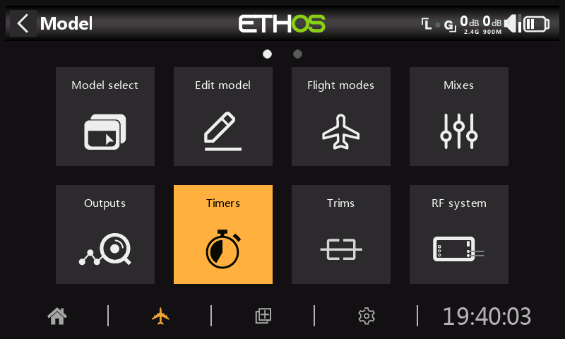

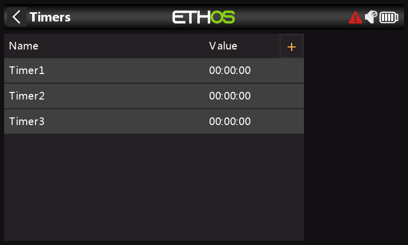

Il y a 8 chronos entièrement programmables qui peuvent compter vers le haut ou vers le bas.

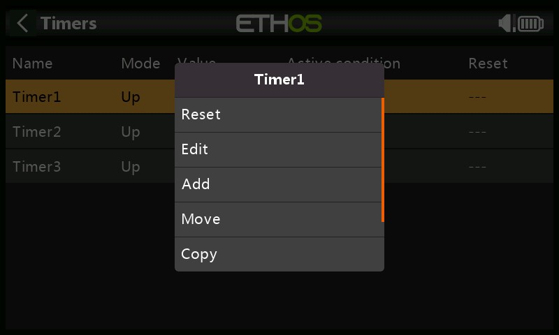

Toucher n'importe quelle ligne de chrono fait apparaître une fenêtre contextuelle avec des options permettant de réinitialiser ou de modifier ce chrono, d'ajouter un nouveau chrono ou de déplacer, de copier/coller le chrono, de dupliquer ou de le supprimer.

**mode (vers le bas, décompte)**

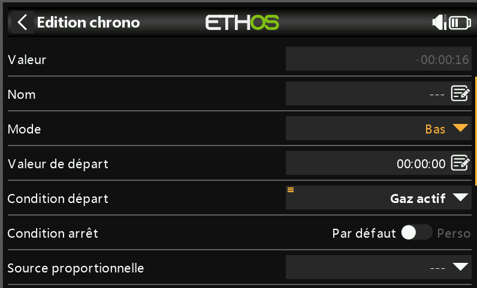

_**Valeur**_

Affiche la valeur actuelle du chrono.

_**Nom**_

Permet de nommer le chrono.

_**Mode**_

Le chrono peut compter vers le haut ou vers **le bas**.

**Valeur de départ**

Si le chrono a été réglé sur le décompte (bas), la valeur de départ est la valeur à partir de laquelle le chrono commence le décompte.

**Condition départ**

La condition de départ lance le chrono. Si la condition d'arrêt ci-dessous est définie sur le réglage par défaut, le chrono démarre et s'arrête uniquement avec la condition de départ. Si la condition d'arrêt ci-dessous n'est pas « par défaut », le chrono démarre lorsque la condition de départ devient "vraie", puis continue de s'exécuter.

**Condition d'arrêt**

Si la condition d'arrêt est 'par défaut', le chrono est contrôlé que par la condition de départ.

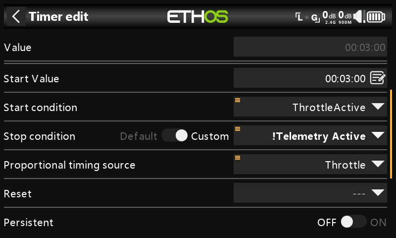

S'il ne s'agit pas de la valeur par défaut, une fois que le chrono est en cours d'exécution, la condition d'arrêt contrôle le chrono. Le chrono s'arrête lorsque la condition d'arrêt est 'vraie", mais continue tant que la condition d'arrêt est 'fausse'.

Dans l'exemple ci-dessus, le minuteur est démarré lorsque Gaz actif devient 'vrai' et s'arrête lorsque la télémétrie n'est plus active.

**Source proportionnelle**

S'il est réglé sur '---, le chronomètre compte en temps réel. Si une source proportionnelle est sélectionnée, la vitesse du chrono est contrôlée par cette source, par exemple le manche des gaz ou même la voie des gaz. Lorsque la valeur de l'accélérateur est de -100 %, le chrono est arrêté. Lorsque la valeur des gaz est de +100%, le chrono compte en temps réel. Avec des valeurs de gaz intermédiaires, le chrono compte proportionnellement.

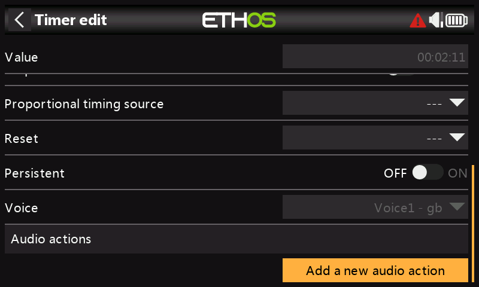

**Réinitialisation**

Le chrono peut être réinitialisée par les positions des inters, les inters de fonction, les inters logiques ou les positions des inters de trim. Notez que le chrono sera maintenu en réinitialisation tant que la condition de réinitialisation est valide.

**Permanent**

En activant cette option, le chrono reste en mémoire même apres une remise en marche de la radio ou en sélection à nouveau ce modèle.
Par exemple : Cumul du temps d'utilisation d'un moteur électrique avec plusieurs vols.

**Voix**

Sélectionnez la voix à utiliser pour les annonces vocales. Reportez-vous à la section Choix des voix pour plus de détails.

**Actions audio**

Les actions audios sont très puissantes et flexibles, ce qui permet de configurer les alertes des chronos exactement selon les besoins de l'utilisateur.

Cliquez sur « Ajout action audio ».

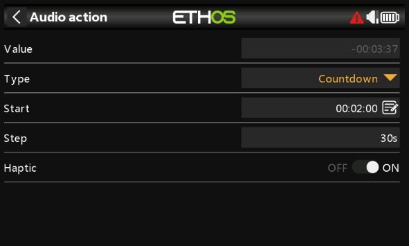

Sélectionnez le type d'action audio requis, c'est-à-dire « Compte à rebours » dans l'exemple ci-dessus.\

_**Départ**_\
**La valeur de départ est la valeur à partir de laquelle cette action de compte à rebours commence.**

_**Répétition**_

**La valeur de pas définit les intervalles auxquels la valeur du minuteur sera annoncée. La valeur du pas peut aller jusqu'à 10 minutes (600 secondes).**

_**Vibreur**_

**Si cette option est activée, une vibration accompagnera les annonces.**

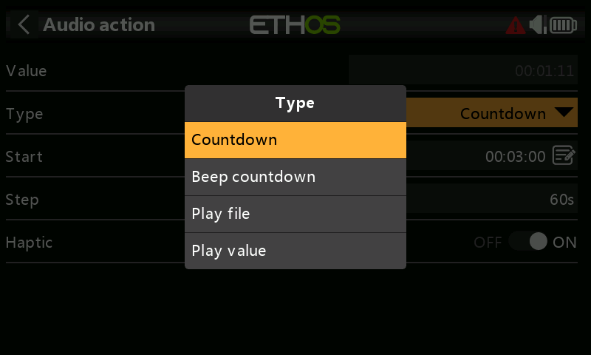\
Les types d'action audio incluent « Décompte (par voix), « bip décompte» (avec des bips au lieu de la voix), « Lire fichier » et « Lire valeur »

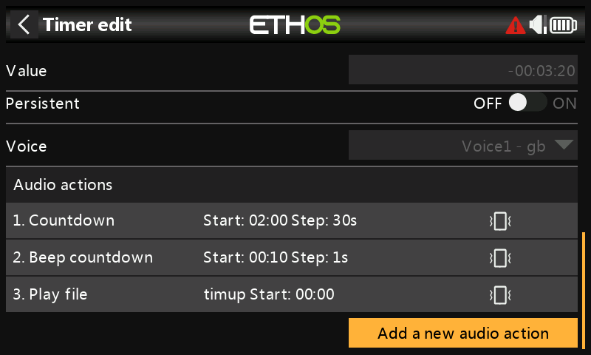

Dans cet exemple, ci-dessus trois actions audios ont été configurées :

1. Tout d'abord, une alerte de compte à rebours (décompte) commençant quand il reste 2 minutes sera donnée toutes les 30 secondes. L'alerte sera vocale et la vibration a également été activée.
2. Deuxièmement, une alerte de compte à rebours commençant à 10 secondes restantes, après quoi un bip sera émis toutes les secondes. Le retour haptique a également été activé.
3. Enfin, un fichier audio personnalisé « timup » sera joué lorsque le temps imparti est écoulé (c'est-à-dire qu'il atteint zéro), accompagné d’une vibration.

D'autres actions audios peuvent être ajoutées en appuyant sur le bouton « Ajouter ». Veuillez noter que la liste doit être classée par ordre de priorité, la priorité la plus élevée se trouvant à la fin de la liste.

**Chronomètre (vers le haut, augmente)**

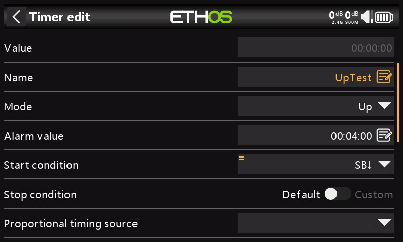

_**Valeur**_

Affiche la valeur actuelle du chrono.

_**Nom**_

Permet de nommer le minuteur.

_**Mode**_

Le chrono peut compter **vers le haut** ou vers le bas.

**Valeur de l'alarme**

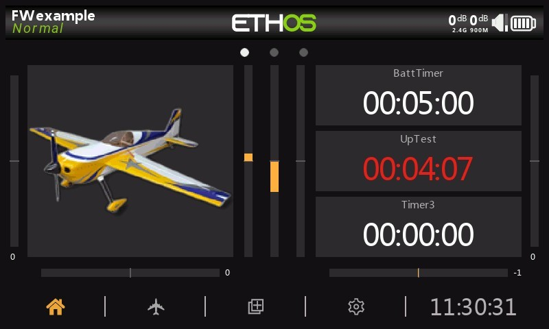

Si le chrono a été réglée sur le compte à rebours, le paramètre de valeur de l'alarme définit la valeur à laquelle le chrono s'écoule. Le minuteur continue de compter, mais la valeur devient rouge dans les widgets du minuteur.

**Condition de démarrage**

La condition de démarrage démarre le minuteur. Si la condition d'arrêt ci-dessous est définie sur le réglage par défaut, le chrono démarre et s'arrête uniquement avec la condition de démarrage. Si la condition d'arrêt ci-dessous n'est pas « par défaut », le minuteur démarre lorsque la condition de démarrage devient d'abord True, puis continue de s'exécuter.

**Condition d'arrêt**

Si la condition d'arrêt est 'default', le chrono n'est contrôlé que par la condition de démarrage.

S'il ne s'agit pas de la valeur par défaut, une fois que le chrono est en cours d'exécution, la condition d'arrêt contrôle le chrono. Le minuteur s'arrête de s'exécuter lorsque la condition d'arrêt est True, mais continue de s'exécuter tant que la condition d'arrêt est False.

**Source de synchronisation proportionnelle**

S'il est réglé sur '---, le chronomètre compte en temps réel. Si une source de synchronisation proportionnelle est sélectionnée, la vitesse du chrono est contrôlée par cette source, par exemple le manche d'accélérateur ou même le canal d'accélérateur. Lorsque la valeur de l'accélérateur est de -100 %, le chrono est arrêté. Lorsque la valeur de l'accélérateur est de +100%, le chronomètre est compté en temps réel. Avec des valeurs d'accélérateur intermédiaires, le chrono compte proportionnellement.

**Réinitialisation**

Le chrono peut être réinitialisée par les positions des inters, les inters de fonction, les inters logiques ou les positions des inters de trim. Notez que le chrono sera maintenu en réinitialisation tant que la condition de réinitialisation est valide.

**Persistant**

Le fait de mettre Persistant sur Activé permet de stocker la valeur du chrono en mémoire lorsque la radio est éteinte ou que le modèle est modifié. La valeur sera rechargée la prochaine fois que le modèle sera utilisé.

**Voix**

Sélectionnez la voix à utiliser pour les annonces vocales. Reportez-vous à la section Choix des voix pour plus de détails.

**Actions audio**

Les actions audios sont très puissantes et flexibles, ce qui permet de configurer les alertes de le chrono exactement selon les besoins de l'utilisateur.

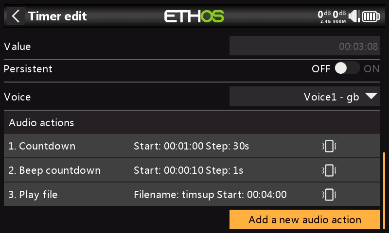

Dans cet exemple, trois actions audio ont été configurées :

1. Tout d'abord, un compte à rebours jusqu'à la valeur de l'alarme à partir de 2 minutes restantes sera donné toutes les 30 secondes. L'alerte sera vocale et le vibreur a également été activé.
2. Deuxièmement, un compte à rebours commençant à 10 secondes restantes, après quoi un bip sera émis toutes les secondes. Le vibreur a également été activé.
3. Enfin, un fichier audio personnalisé 'timsup' sera lu lorsque le chrono s'écoulera en atteignant la valeur de l'alarme, accompagné d'un vibreur.

D'autres actions audio peuvent être ajoutées en appuyant sur le bouton « Ajouter ». Veuillez noter que la liste doit être classée par ordre de priorité, la priorité la plus élevée se trouvant à la fin de la liste.
