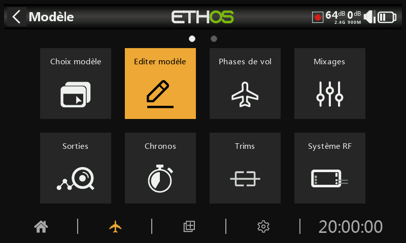
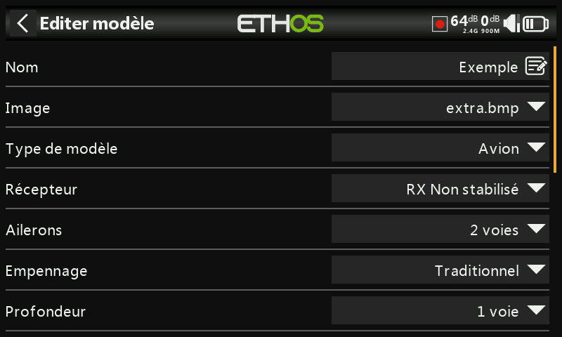

## Edition modèle

L'option 'Modifier le modèle' permet de modifier les paramètres de base du modèle tels qu'ils ont été configurés par l'assistant.

**Nom, Image**

Le modèle peut être renommé, ou l'image peut être attribuée ou modifiée. Lors de la recherche d'une image, une vignette d'aperçu s'affiche pour faciliter la localisation de l'image correcte.

**Type de modèle**

La modification du type de modèle entraînera la réinitialisation de tous les mixages.

**Affectations de voies**

La modification du type d'empennage ou du plateau oscillant de l'hélicoptère entraînera la réinitialisation de tous les mixages. Sur les autres voies, le nombre de voies attribués peut être modifié ou annulé.

**Inters de fonction**

.jpeg>)

Les six inters de fonction sont disponibles partout où se trouvent les paramètres de « condition active ». Veuillez noter qu'ils ne peuvent pas être utilisés comme source comme le peuvent les inters normaux.

.jpeg>)

**Configuration**

Ils peuvent être configurés comme suit :

**6-Pos avec OFF**

Appuyez sur n'importe quel interrupteur de fonction pour le verrouiller. Cependant, appuyer une deuxième fois sur un interrupteur déjà allumé l'éteindra, laissant les six interrupteurs de fonction éteints.

**6-Pos**

Appuyez sur n'importe quel interrupteur de fonction pour verrouiller cet interrupteur sur ON jusqu'à ce qu'un autre interrupteur de fonction soit enfoncé pour verrouiller l'interrupteur nouvellement enfoncé.

_**2 x 3 Pos**_

Divise les 6 inters de fonction en deux groupes de 3. Chaque groupe peut avoir un interrupteur allumé.

_**6 x 2 Pos**_

Décompose les 6 interrupteurs de fonction en 6 interrupteurs de verrouillage. Chaque interrupteur peut être activé ou désactivé.

**Poussoir**

Décompose les 6 inters de fonction en 6 inters momentanés. Chaque interrupteur est allumé lorsqu'il est enfoncé.

**Permanent**

Si cette option est activée, l’inter de fonction sera dans le même état lorsque la radio sera allumée ou que le modèle sera rechargé.

**Connecteur SPort**

.jpeg>)

La broche 5V sur le connecteur SPort peut être contrôlée modèle par modèle, pour alimenter par exemple un récepteur externe dans une application d'entraînement.

**Filtre analogique**

.jpeg>).jpeg>)

Il existe un paramètre global de filtre de convertisseur analogique-numérique sur la page Matériel sous Filtre analogique, ce qui peut améliorer la gigue autour du centre du manche. Ce paramètre spécifique au modèle peut être utilisé pour remplacer le paramètre global.

**Supprimer tous les mixages**

.png>)

L'exécution de l'option « Réinitialiser tous les mixages » réinitialisera tous les mixages.
