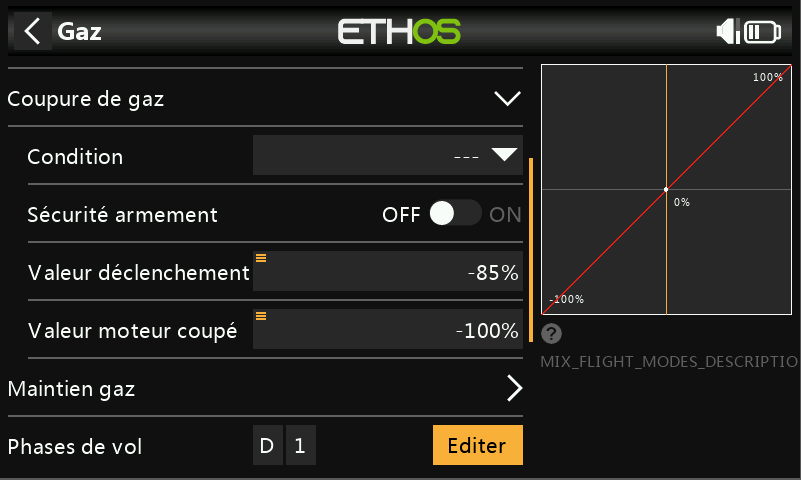
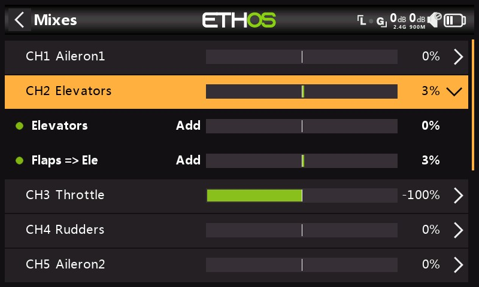
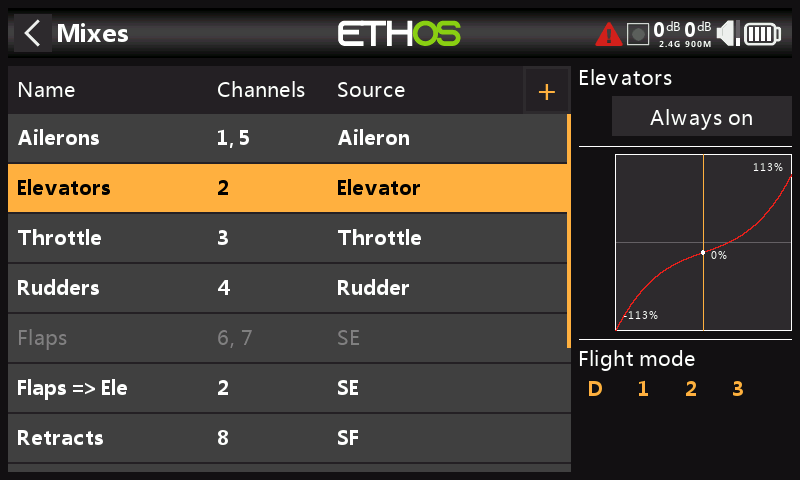
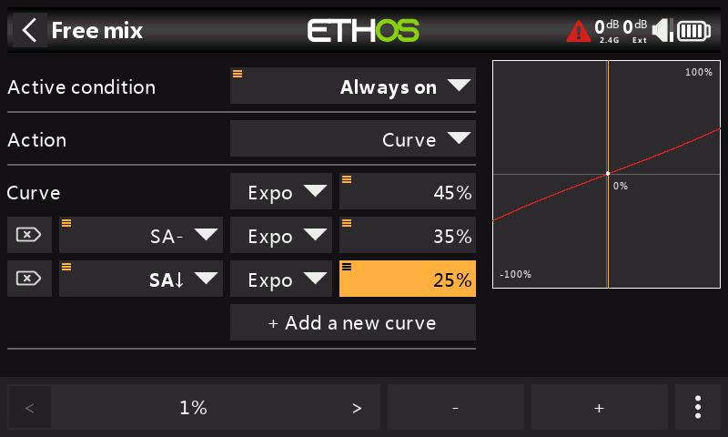

# Mixages

#### Mixages 

.jpeg>)\

La fonction Mixages constitue le cœur de la radio. C'est là que les fonctions de contrôle du modèle sont configurées. La section Mixages permet de mixer ou de combiner n'importe laquelle des nombreuses sources d'entrée à volonté et de les diriger sur l'un des voies de sortie. Ethos dispose de 100 possibilités de mixage pour la programmation de votre modèle. Normalement, les voies numérotées les plus bas seront attribués aux servos, car les numéros correspondent géneralement aux voies du récepteur. Le module RF (radiofréquence) interne permet jusqu'à 24 voies physiques.

Il est conseillé d'utiliser les mixages au dela de 24 comme « voies virtuelles » dans une programmation avancée, ou comme voies réels en utilisant plusieurs modules RF (internes + externes) et SBus. L'ordre des voies est une question de préférence personnelle ou de convention, ou il peut être dicté par le récepteur. Nous utiliserons APGD (Aileron, Profondeur, Gaz, Dérive) pour notre exemple. (en anglais AETR)

La source ou l'entrée d'un mixage peut être choisie à partir d'entrées analogiques telles que les manches, les potentiomètres et les curseurs ; les interrupteurs à bascule ou les boutons ; tous les inters logiques définis ; les inters de trim ; tous les voies définies ; un axe gyroscopique ; une voie élève ; un chrono ; un capteur de télémétrie ; une valeur du système telle que la tension radio principale ou la tension de la batterie RTC ; ou une valeur 'spéciale' telle que 'minimum', 'maximum' ou 0.

Cette section permet également de conditionner la source en définissant des courses ( débattements) et des décalages, et en ajoutant des courbes (ex : Expo). Le mixage peut être soumis à un switch et/ou à des pahses de vol, et une fonction de ralenti peut être ajoutée. (Notez que les retards sont implémentés dans les inters logiques, car ils sont liés aux inters.) 
L'éditeur de mixage inclut des informations d'aide contextuelle qui changent dynamiquement lorsque les options de mixage sont modifiées. La première ligne indique le type de mixage utilisé, tel que 'Ailerons', 'Profondeur' ou 'Mixage libre', etc. 
Jusqu'à 120 mixages peuvent être définis. Un nouveau mixage peut également être ajouté en appuyant sur le symbole '+'..

.png>)

Si votre modèle a été créé à l'aide d'un assistant  « Choix modèle » du menu Système, les mixages de base apparaitront dans cette section. 
De plus, les mixages prédéfinis les plus courants peuvent être ajoutés ainsi que des mixages libres configurables par l'utilisateur. 

.jpeg>)

Pour modifier un mixage, une fois sélectionné, appuyez à nouveau afin d'accéder au menu contextuel, puis sélectionnez Modifier. D'autres options sont d'ajouter un nouveau mixage, de passer à la 'vue par sorties' (décrite dans une section plus bas), de déplacer le mixage vers le haut ou vers le bas, de dupliquer un mixage ou de le supprimer.

NB : Les mixages inactifs sont affichés en grisé, pour faciliter la programmation.
NB : Une confirmation sera demandée avant la suppression d'un mixage par mesure de sécurité.

**Mixages d'ailerons, de profondeur et de gouvernail**

Le mixage 'ailerons' est proposé en exemple mais la programmation reste identique pour la profondeur et dérive.

\
.png>)

_**Nom**_

Ailerons a été renseigné par défaut, mais peut être modifié.

**Condition**

La condition d'activation par défaut est « Toujours », ce qui est approprié pour les ailerons. Le mixage peut être rendu conditionnel en choisissant parmi les positions des interrupteurs ou des boutons, les inters de fonction, les phases de vol, les inters logiques, un événement système tel que la coupure ou le maintien des gaz, ou les positions de trim.

**Phases de vol**

Si des phases de vol ont été définies, le mixage peut être conditionné à une ou plusieurs phases de vol. Cliquez sur 'Editer' et cochez les cases des phases de vol dans lesquels ce mixage doit être actif.

**Courbe**

.png>)

Une oourbe 'Expo' est disponible en standard, avec une valeur par défaut de 0. Dans ce cas, la réponse est linéaire. Une valeur positive adoucira la réponse autour de 0, tandis qu'une valeur négative accentuera la réponse. L'exemple ci-dessus montre une Expo de 30%. Le résultat s'affiche en temps réèl dans la fenêtre de droite.
Toute autre courbe préalablement définie dans le menu 'Courbes' peut être sélectionnée. Vous pouvez aussi ajouter une courbe directement. La sortie de mixage sera alors modifiée par cette courbe. 
6 courbes peuvent être appliquer à un mixage, chacune avec une condition. Si plusieurs conditions sont remplies, la courbe la plus élevée dans la liste prévaut. 
NB : La courbe est appliquée avant la course (débattement) 

**Courses (débattements)**

Plusieurs courses ou taux peuvent être définis, sous réserve d'une position de inter, d'un inter de fonction, d'un inter logique, d'une position de trim ou d'une phase de vol. Une ligne est ajoutée pour chaque course. La course par défaut (c'est-à-dire la première ligne) est actve lorsqu'aucune autre course n'est acrive.
Pour supprimer une ligne, appuyer sur la croix dans le symbôle à gauche de la ligne correspondante. 

Dans l'exemple ci-dessus, trois courses ont été configurées selon l'inter SB.

.jpeg>)

Dans l'exemple ci-dessus, un appui long sur Entrée fait apparaître une boîte de dialogue pour sélectionner une source au lieu d'une valeur fixe par défaut, dans ce cas Pot1 est sélectionné. Le graphique de droite montre que le potentiomètre est à 65%, ce serait donc le Débattement pour les taux d'ailerons, mais réglable en vol.

**Différentiel**

.png>)

Le différentiel offre plus de débattement dans une direction. Par exemple, pour les ailerons, on utilise généralement une plus grande course vers le haut que vers le bas pour réduire le lacet inverse et pour améliorer les caractéristiques de virage et de maniabilité. Une valeur positive se traduira par une course vers le bas plus faible des ailerons, comme on peut le voir dans le graphique ci-dessus. (Valeur par défaut = 0. Plage de -100 à +100). Le différentiel de profondeur peut être utilisé pour les avions qui veulent moins de profondeur vers le bas que vers le haut, généralement dans des situations de course. 

NB : l'option Différentiel n'apparait que lorsque vous avez plus d'une voie de sortie (nombre voies).

NB : L'option Différention ne sera disponible que pour un empennage en V.

**Trim**

Permet de déconnecter le trim associé à un mixage sans le désactiver physiquement, afin qu'il puisse être utilisé ailleurs.

**Nombre voies**

.png>)

Le nombre de voies définit le nombre de voies de sortie alloués. Dans cet exemple, deux ailerons ont été configurés dans l'assistant de création de modèle.

**Sortie1, Sortie2**

L'assistant de création de modèle a attribué les voies 1 et 2 aux ailerons, car l'ordre des voies par défaut dans le menu Système – Manches était réglé sur AETR (APGD), c'est-à-dire ailerons, profondeur, manette des gaz, gouverne de direction.

La valeur par défaut peut être modifiée si nécessaire, mais il faut faire preuve de prudence pour évaluer tout autre impact d'une modification ici.

NB :  \[ENT\_long] sur le canal de sortie sélectionné vous amènera directement à cette page dans les sorties.

NB: Le graphique est codé par couleur pour les sorties. Dans l'exemple ci-dessus, Output1 est rouge, ce qui correspond à la courbe rouge du graphique, et Output2 est orange, ce qui correspond à la courbe orange du graphique.

**Mixage "Gaz"**

Des options supplémentaires sont disponibles : coupure et maintien des gaz. 

.jpeg>)

**Entrée**

Choix de la source des gaz. Par défaut, il s'agit du manche des gaz mais il peut être remplacé par un potentiomètre, un curseur, un inter, un trim, un canal, un axe gyroscopique, une voie élève, un chrono ou toute autre valeur spéciale.

**Trim**

Permet de choisir un autre trim que celui de gaz par défaut.

.png>)

Le X20 Pro/R/RS et le X18 permettent également d'attribuer les versions T5 ou T6.

**Trim Ralenti**

.png>)

Pour les moteurs thermique, le « trim ralenti » est utilisé pour régler le ralenti moteur. Ce ralenti peut varier en fonction des conditions météorologiques, etc., il est donc important d'avoir un moyen d'ajuster le ralenti sans affecter la position de plein gaz.

Si l'option « Trim ralenti » est activée, la voie des gaz aura une valeur de -75 % lorsque le manche des gaz est en position basse (Veuillez-vous référer à l'affichage de la barre de canal en bas de la capture d'écran ci-dessus). Le trim de gaz peut alors être utilisé pour régler le régime de ralenti entre -100 % et -50 %.

**Coupure gaz**

La coupure permet à la voie un verrouillage de sécurité du manche des gaz qui garantit que la voie ne s'active qu'à partir d'une position des gaz au ralenti.

Lorsqu'il est combiné avec le « trim ralenti » (voir ci-dessus), il peut être utilisé pour gérer les réglages du plein gaz et du ralenti sur les modèles thermiques..

**Condition**

La condition d'activation peut être choisie parmi les positions des interrupteurs ou des boutons, les inters de fonction, les phases de vol, les inters logiques ou les positions de trim.

**Sécurité armement**

Lorsque « Sécurité armement » est activé, la voie des gaz ne sera fonctionnelle que si la position du manche des gaz passe par une valeur inférieure à la valeur de déclenchement définie ci-après (par défaut -85 %).

**Valeur déclenchement**

La valeur de déclenchement détermine la valeur en dessous de laquelle l'entrée de l'accélérateur déclenche le fonctionnement d ela voie des gaz.

**Valeur moteur coupé**

Lorsque la sécurité moteur est activé, la voie des gaz passera à cette valeur afin de s'assurer du bon arrêt du moteur qu'il soit thermique ou électrique.

NB : Cette option est importante sur un modèle électrique afin d'éviter le démarrage intenpestif du moteur lors d'une manipulation de la radio par exemple.

**Maintien gaz**

Maintien des gaz sans le verrouillage de sécurité de « Coupure gaz » ci-dessus.

.jpeg>)

**Condition**

La condition active peut être choisie parmi les positions des interrupteurs ou des boutons, les inters de fonction, les modes de vol, les inters logiques ou les positions de trim.

**Valeur**

Une fois que la fonction de maintien ds gaz est active, le réglage de la valeur sera affiché sur la voie des gaz. Sur les modèles électriques, la valeur de maintien des gaz est généralement de 100 %.

La valeur de maintien des gaz peut également provenir d'une source.

**Phases de vol**

Si des phases de vol ont été définies, le mixage peut être conditionné par une ou plusieurs phases de vol. Cliquez sur 'Modifier' et cochez les cases des phases de vol dans lesquels ce mixage doit être actif.

**Courbe**

Une courbe peut être définie pour modifier la sortie de la voie des gaz pour plus de linéarité par exemple de puissance. Toute courbe préalablement définie peut également être sélectionnée.

**Option d'affichage par voies (regroupement des mixages)**

Avec des mixages complexes, il peut être difficile de voir l'effet d'autres mixages sur une voie particulière. L'option 'Afficher par voie' est particulièrement utile pour mettre au point vos mixages, car tous les mixages qui affectent la voie sélectionnée sont regroupés.

.png>)

Pour cet exemple, nous allons examiner la voie Profondeur. Nous pouvons voir dans la vue tableau des mixages ci-dessus que l'ascenseur est sur le canal 2, et que plus bas, il y a un mixage Flaps to Elevators également avec le canal 2 en sortie.

\
.png>)

Pour voir l'effet de tous les mixages sur la voie de Profondeur, appuyez sur le mixage Profondeurs et sélectionnez « Afficher par voie » dans la boîte de dialogue contextuelle.

.png>)(fr)

L'exemple ci-dessus montre qu'il y a deux mixages qui ont un impact sur cette voie : Les profondeurs se mixent eux-mêmes (contrôlés par le manche de profondeur) et un mixage Volets=>Profondeurs qui ajoute

Compensation de la gouverne de profondeur lorsque les volets sont sortis. En regardant la ligne récapitulative des profondeurs V2 (en surbrillance), nous pouvons voir que la sortie du canal de profondeur est à +3%. Les mixages secondaires montrent qu'actuellement le manche de profondeur est au point mort (c'est-à-dire 0 %), mais que le mixage des volets à la profondeur ajoute +3 % au canal. L'utilisation de l'interrupteur Flap entraînera une modification de ce mixage de compensation.

Avec cette disposition 'Vue par voie', la contribution des différents mixages affectant un canal peut être facilement vue, car la valeur de chaque mixage est affichée à la fois sous forme graphique et numérique.

**Gestion de l'affichage 'Vue par voie'**

**a) Passer d'une voie à l'autre dans « Affichage par voie »**

En cliquant sur la ligne récapitulative (mise en surbrillance ci-dessus), les sous-mixages de la chaîne seront montrés.

.jpeg>)

Comme on peut le voir ci-dessus, les sous-mixages pour les profondeurs CH2 ont été cachés. Vous pouvez maintenant faire défiler vers le haut ou vers le bas et sélectionner un autre canal à développer pour afficher les mixages contribuant à ce canal.

**b) Retour à la « vue Tableau »**

.jpeg>)

En cliquant sur un sous-mixage à la place, par exemple la ligne mise en évidence ci-dessus, une boîte de dialogue contextuelle s'affichera pour permettre de modifier le mixage, de passer en mode Tableau ou de supprimer le mixage.

.jpeg>)

Si vous sélectionnez l'affichage Tableau, vous reviendrez à l'affichage normal des mixages au format tableau. Vous pouvez également modifier le mixage en surbrillance ou le supprimer.

\

Nous sommes de retour dans la vue tableau des mixages.

**Bibliothèque de mixages**

**Bibliothèque d'avions**

.png>)(fr)

**Mixage libre**

Les mixages libres sont les mixages à usage général à tout faire. Les mixages prédéfinis sont à certains égards plus puissants, mais sont également plus limités à leur application spécifique. Toutes les options ne sont pas nécessairement disponibles dans les mixages mis à disposition, mais tout peut être fait avec eux, il faudra peut-être plus d'un mixage libre pour faire la même chose qu’un seul mixage spécialisé.

Appuyez sur n'importe quel mixage, puis sélectionnez « Ajouter » dans le menu contextuel pour ajouter un nouveau mixage.

Sélectionnez « Mixage libre » dans la liste des mixages prédéfinis disponibles dans la bibliothèque de mixages.

.jpeg>)

Ensuite, il faut choisir la position du nouveau mixage, dans cet exemple ajoutée après 'Dernière position'.

\
.png>)

Appuyez sur « Mixage libre » pour faire apparaître le sous-menu d'édition.

.jpeg>)

Sélectionnez Modifier pour ouvrir un nouvel écran affichant les paramètres détaillés du « Mixage libre ». L'affichage graphique à droite affichera la sortie de mixage et l'effet de toutes les modifications de réglage apportées.

.png>)

Nom

Un nom descriptif peut être saisi pour le Mixage libre.

Condition active

La condition active par défaut est « Toujours activé ». Il peut être rendu conditionnel en choisissant parmi les positions des interrupteurs ou des boutons, les inters de fonction, les phases de vol, les inters logiques, un événement système tel que la coupure ou le maintien des gaz, ou les positions de trim.

Phases de vol

Si des phases de vol ont été définies, le mixage peut être conditionné à un ou plusieurs phases de vol. Cliquez sur 'Modifier' et cochez les cases des phases de vol dans lesquels ce mixage doit être actif.

Source

La source ou l'entrée de ce mixage peut être choisie parmi : a) les entrées analogiques telles que les manches, les potentiomètres et les curseurs

1. les interrupteurs à bascule ou les boutons
2. tous les inters logiques définis
3. Les inters de trim
4. tous les voies définis
5. un axe gyroscopique
6. Un canal de formateurs
7. un chrono
8. un capteur de télémétrie
9. une valeur du système (par exemple, la tension radio principale ou la tension de la batterie RTC)
10. une valeur 'spéciale', c'est-à-dire minimum, maximum ou 0

Le mixage prendra la valeur de la source à tout moment comme entrée.

Opération

Le type d'opération définit la façon dont le mixage actuel interagit avec les autres sur le même canal. Il existe trois types de fonctions :

Addition

La sortie de ce mixage sera ajoutée à tous les autres mixages sur le même canal de sortie. Veuillez noter que les mixages d'addition peuvent être dans n'importe quel ordre (A+B+C = C+B+A).

Multiplier

La sortie de ce mixage sera multipliée avec le résultat des autres mixages au-dessus sur le même canal de sortie.

Remplacer

La sortie de ce mixage remplacera le résultat de tout autre mixage sur le même canal de sortie.

Verrouillage

Une voie qui est « verrouillée » ne sera jamais modifiée par un autre mixage tant que le verrouillage est actif

La combinaison de ces opérations permet la création d'opérations mathématiques complexes.

Actions

.png>)

Le mixage libre est extrêmement flexible dans la mesure où il est possible de définir jusqu'à 50 actions de mixage.

.png>)\
Appuyez sur «Ajout action » pour ajouter une action de mixage libre. Remarque : la source a été réglée sur 'Aileron' à des fins d'exemple.

.png>)

Les actions disponibles sont les suivantes :

* Courbe
* Débattement
* Différentiel
* Décalage
* Ralenti

Les actions peuvent être combinées pour créer, par exemple, plusieurs taux avec plusieurs courbes d'exposition, différentes valeurs de différentiel, etc.

L'ordre des actions recommandées est Ralenti, Courbe, Débattement puis Décalage. Cette règle doit être respectée, à moins qu'il n'y ait une raison spécifique d'utiliser un ordre différent.

Débattement (course)

.png>)

Par défaut, le mixage libre commence par une action ‘Course’ de 100% qui est 'Toujours activé'.\
.png>)

**Important** : Pour configurer le taux du mixage libre appuyez sur la ligne Course par défaut et sélectionnez ‘Editer' pour apporter des modifications ou des ajouts. Sélectionner 'Ajouter une nouvelle action' ajouterait une deuxième action Course à la place.

.png>)

Appuyez sur « Ajout course » pour ajouter des débattements supplémentaires. Par exemple, pour créer plusieurs débattements en fonction d'un inter 3 positions.

.png>)

Dans l'exemple ci-dessus, deux débattements (ou taux) supplémentaires ont été ajoutés à l'aide du commutateur SA.

.png>)

Lorsque l'interrupteur n'est pas en position centrale ou basse, le poids sera de 100%\

Débattements selon le sens

.png>)(fr)

.png>)(fr)

Dans les conditions actives pour les actions de mélange libre, il y a quatre « directions » de source disponibles, c'est-à-dire haut, bas, droite, gauche.

.png>)

Pour différents poids vers le haut et vers le bas (pour imiter les précédents 'Poids vers le haut' et 'Poids vers le bas'), les conditions peuvent être définies sur 'Haut' et sur 'Sinon' par défaut.

Courbe

.jpeg>)

Pour ajouter des courbes au mixage, sélectionnez « Courbe » dans le menu déroulant des actions.

.png>)

Une option de courbe standard est Expo, qui par défaut a une valeur de 0, ce qui signifie que la réponse est linéaire (c'est-à-dire qu'il n'y a pas de courbe). Une valeur positive adoucira la réponse autour de 0, tandis qu'une valeur négative accentuera la réponse.\

Exemple de « Débattements » d'exponentiels multiples

Dans cet exemple, 3 taux d'exponentiels ont été définis pour accompagner les taux de débattements (courses) définis ci-dessus.\

.png>)

Avec le commutateur SA en position médiane, le taux de débattement est de 70 % tandis que l'exponentiel est de 35 %. Avec l'interrupteur SA en position basse, le taux de débattement est de 50 % tandis que l'expo est de 25 %. Avec le commutateur SA en position par défaut (haut), le taux de débattement par défaut est de 100 % tandis que la courbe d'expo par défaut est de 45 %.

.png>)

N'importe quelle courbe précédemment définie peut également être sélectionnée (nommée CV1 dans l'exemple ci-dessus). La sortie de mixage sera alors modifiée par cette courbe.

Exemple de « Débattements » d'exponentiels multiples

.png>)

Dans cet exemple, 3 taux d'exponentiels ont été définis pour accompagner les taux de débattements (courses) définis ci-dessus.\

.png>)

Avec le commutateur SA en position médiane, le taux de débattement est de 70 % tandis que l'exponentiel est de 35 %. Avec l'interrupteur SA en position basse, le taux de débattement est de 50 % tandis que l'expo est de 25 %. Avec le commutateur SA en position par défaut (haut), le taux de débattement par défaut est de 100 % tandis que la courbe d'expo par défaut est de 45 %.

.png>)

N'importe quelle courbe précédemment définie peut également être sélectionnée (nommée CV1 dans l'exemple ci-dessus). La sortie de mixage sera alors modifiée par cette courbe.

Avec les mixages libres et d'autres mixages, vous pouvez spécifier jusqu'à 6 courbes, chacune avec une condition. Si plusieurs conditions sont remplies, la courbe la plus élevée dans la liste prévaut.

Notez que les courbes sont appliquées avant le Débattement.

Différentiel

.jpeg>)

Pour ajouter un différentiel au mixage, sélectionnez « Différentiel » dans le menu déroulant des actions.

.png>)

Une valeur positive se traduira par une sortie de mixage ayant moins de course vers le bas. (Valeur par défaut = 0. Plage de -100 à +100). With a value of 50% downward travel is half of the upward travel, as can be seen in the example above.

Veuillez-vous référer à la description du mixage Ailerons pour plus de détails.

Décalage

.jpeg>)

Pour ajouter un décalage au mixage, sélectionnez « Décalage » dans le menu déroulant des actions.

.png>)

Un décalage décalera la sortie de mixage vers le haut ou vers le bas de la valeur de décalage saisie ici. Les valeurs négatives sont autorisées.

Deux valeurs de décalage peuvent être définies, l'une lorsque le mixage libre est actif et l'autre lorsque le mixage libre est inactif.

Ajout d'un trim à un mixage libre

.png>)

\
.png>)

Dans l'exemple ci-dessus, le trim de gaz a été sélectionné comme source pour ajuster le décalage.

\
.png>)\

Par défaut, les versions ont une plage de +/- 25 %. Lorsqu'il est utilisé comme source, les trims peuvent éventuellement être modifiés en plage complète +/- 100 % (appuyez longuement sur Entrée sur le trim).

Ralenti

.jpeg>)

Pour ajouter un ralentissement à la sortie du mixage libre, sélectionnez « Ralenti » dans le menu déroulant des actions.

.jpeg>)

La réponse de la sortie peut être ralentie en ce qui concerne le changement d'entrée. Slow pourrait par exemple être utilisé pour ralentir les rentrées qui sont actionnées par un servo proportionnel normal. La valeur est le temps en secondes qu'il faudra à la sortie pour couvrir la plage de -100 à +100 %.

Des valeurs différentes peuvent être définies pour les directions vers le haut et vers le bas.

Nombre de voies

Le nombre de voies définit le nombre de voies de sortie alloués.

Inverse

La sortie de ce mixage peut être inversée ou inversée en activant cette option. Veuillez noter que l'inversion du servo doit être effectuée sous Sorties. Cette option permet d'obtenir la bonne logique de mixage.

Sortie

N'importe quel canal peut être sélectionné pour recevoir la sortie de ce mixage. Si le nombre de voies ci-dessus est supérieur à un, un canal doit être configuré pour chaque sortie.

_**Suite de la bibliothèque de mixages**_

_**Aileron, Gouverne de profondeur, Dérive**_

Veuillez-vous référer à la description détaillée des mixages de gouverne de profondeur d'aileron ci-dessus.

**Volets**

Le mixage 'Volets' mixera une entrée sur un ou plusieurs voies avec des Débattement individuels. Il offre également des options de vitesses.

**Gaz**

Le mixage 'Gaz' est destiné au contrôle du moteur et comprend des options de coupure et de maintien de l'accélérateur. Veuillez-vous référer à la discussion détaillée sur le mixage des gaz ci-dessus.

**QuadroFlap**

Ce mixage est couramment utilisé sur les planeurs afin que les volets se déplacent avec les ailerons pour augmenter la réponse des ailerons du modèle.

**Ail => Dir**

Ce mixage est couramment utilisé pour réduire les dérapages dans les virages. Cependant, ce mixage ne sera correct qu'à une vitesse et à une orientation particulière. Il est préférable d'apprendre à corriger le dérapage avec un contrôle manuel de la dérive.

**Aérofrein**

Le mixage d'aérofreins est similaire au mixage de papillon ci-dessous, sauf qu'il est contrôlé par une condition active marche-arrêt.

**Papillon**

Le freinage papillon ou crocodile est utilisé pour contrôler le taux de descente d'un avion. Les ailerons sont réglés pour monter un peu plus haut, tandis que les volets s'abaissent beaucoup. Cette combinaison crée beaucoup de traînée, et est très efficace pour le freinage et donc idéale pour contrôler l'approche à l'atterrissage. L'entrée est normalement réglée sur un curseur (ou sur le manche des gaz d'un planeur).

Une compensation est également nécessaire sur la gouverne de profondeur pour éviter que le planeur monte lorsque le crocodile est appliqué.

NB : ce mixage a un décalage intégré afin que la sortie de mixage soit nulle à la position neutre des volets, c'est-à-dire lorsque le manche des gaz (ou toute autre source) est à sa position basse, et au maximum à la position des volets complètement déployés, c'est-à-dire la position haute du manche des gaz (ou de la source alternative). Ce décalage est désactivé lorsqu'une courbe utilisateur est ajoutée pour donner à cette courbe un contrôle total.

**Courbure**

Le mixage de carrossage est généralement utilisé pour appliquer un peu de cambrure sur les surfaces de l'aile afin d'augmenter la portance.

**Volet => PRF**

Le mixage volet à profondeur est utile pour la compensation de sortie des volets, où une courbe de compensation personnalisée est requise.

**SnapFlap**

Ce mixage ajoute des volets à l'aile lorsque la profondeur est appliquée. Cela permet à l'aile de générer de la portance plus efficacement lorsque l'avion reçoit des commandes de profondeur.

_**Dir**_** => **_**Ail**_

Ce mixage est utilisé pour contrer le lacet induit par la dérive en vol en lame de couteau.

_**Dir**_** => **_**Prf**_

Ce mixage peut aider à améliorer le vol en lame de couteau lorsqu'il y a des problèmes d'accouplement.

**Snap Roll**

Le déclenché ( Snap Roll) est une manœuvre d'auto-rotation dans un état de décrochage. Lors d'un claquement, une aile est décrochée tandis que l'autre est accélérée autour de l'axe de roulis. Cela crée une accélération soudaine du taux de roulis que vous ne pouvez pas obtenir en entrant simplement l'aileron. Pour atteindre cette condition dans un modèle, plusieurs entrées doivent être données, notamment la profondeur, la gouverne de direction et l'aileron. Par exemple, vous pouvez effectuer un claquement intérieur gauche en programmant le mixage pour appliquer simultanément la gouverne de profondeur vers le haut, la gouverne de direction gauche et l'aileron gauche pendant 1 à 2 secondes. Récupérez de la manœuvre en neutralisant les manches et en ajoutant immédiatement la dérive droit pour corriger votre perte de cap.

**Gaz => Prf**

Ce mixage permet de compenser la profondeur pour les avions qui changent de tangage lors d'un changement de manette des gaz.

Veuillez noter que le mixage a un décalage intégré de sorte que la sortie de mixage est nulle lorsque le manche des gaz est à sa position basse, et au maximum à la position haute du manche des gaz. Ce décalage est désactivé lorsqu'une courbe utilisateur est ajoutée pour donner à cette courbe un contrôle total.

**Gaz => Dir**

Ce mixage aidera l'avion à voler droit lorsqu'il est à plein régime ; C'est généralement nécessaire lors du vol d'une ligne verticale vers le haut.

Veuillez noter que le mixage a un décalage intégré de sorte que la sortie de mixage est nulle lorsque le manche des gaz est à sa position basse, et au maximum à la position haute du manche des gaz. Ce décalage est désactivé lorsqu'une courbe utilisateur est ajoutée pour donner à cette courbe un contrôle total.

**Test Mix**

Ce mixage est idéal pour tester les servos de trempage. Il comprend un réglage de portée, ainsi que Ralentir et ralentir.

**Décalage**

Le mixage Décalage permet d'ajouter une valeur fixe au mixage lorsqu'un décalage est requis. Une application courante est pour les volets, où le klaxon du servo est décalé dans une direction afin de maximiser la course des volets vers le bas. Il en résulte que les volets sont en position mi-basse au point mort servo. Le mixage décalé peut ensuite être utilisé pour amener les volets à la position « neutre de surface » lorsque la sortie de mixage des volets est nulle.

**Bibliothèque de planeurs**

.png>)

_**Mixage**_ libre

Veuillez-vous référer à la description du mixage libre dans la section Bibliothèque d'avions ci-dessus.

_**Aileron, Gouverne de profondeur, Dérive**_

Veuillez-vous référer à la description détaillée des mixages de gouverne d'ailerons, profondeur et direction ci-dessus.

**Volets**

Le mixage Flaps mixera une entrée sur un ou plusieurs voies avec des Débattement individuels. Il offre également des options de ralentissement et de ralentissement.

**Gaz**

Le mixage d'accélérateur est destiné au contrôle du moteur et comprend des options de coupure et de maintien de l'accélérateur. Veuillez-vous référer à la discussion détaillée sur le mixage d'accélérateur ci-dessus.

**QuadroFlap**

Ce mixage est couramment utilisé sur les planeurs afin que les volets se déplacent avec les ailerons pour augmenter la réponse des ailerons du modèle.

**Ail => Dir**

Ce mixage est couramment utilisé pour réduire les dérapages dans les virages. Cependant, ce mixage ne sera correct qu'à une vitesse et à une orientation particulière. Il est préférable d'apprendre à corriger le dérapage avec un contrôle manuel de la dérive.

**Aérofrein**

Le mixage d'aérofreins est similaire au mixage de papillon ci-dessous, sauf qu'il est contrôlé par une condition active marche-arrêt.

**Papillon**

Le freinage papillon ou crocodile est utilisé pour contrôler le taux de descente d'un avion. Les ailerons sont réglés pour monter un peu plus haut, tandis que les volets s'abaissent beaucoup. Cette combinaison crée beaucoup de traînée, et est très efficace pour le freinage et donc idéale pour contrôler l'approche à l'atterrissage. L'entrée est normalement réglée sur un curseur (ou sur le manche des gaz d'un planeur).

Une compensation est également nécessaire sur la gouverne de profondeur pour éviter que le planeur ne gonfle lorsque le crocodile est appliqué.

Veuillez noter que le mixage a un décalage intégré de sorte que la sortie de mixage est nulle à la position neutre des volets, c'est-à-dire lorsque le manche des gaz (ou la source alternative) est à sa position basse, et au maximum à la position des volets complètement déployés, c'est-à-dire la position haute du manche des gaz (ou de la source alternative). Ce décalage est désactivé lorsqu'une courbe utilisateur est ajoutée pour donner à cette courbe un contrôle total.

_**Courbure**_

Le carrossage est généralement utilisé pour appliquer un certain carrossage sur les surfaces de l'aile afin d'augmenter la portance.

**Volet => PRF**

Le mixage volet à profondeur est utile pour la compensation volets/carrossage/ crocodile, où une courbe de compensation personnalisée est requise.

**SnapFlap**

Également connu sous le nom de Snap Flap, ce mixage ajoute du carrossage à l'aile lorsque la profondeur est appliquée. Cela permet à l'aile de générer de la portance plus efficacement lorsque l'avion reçoit des commandes de tangage.

_**Dir**_** => **_**Ail**_

Ce mixage peut être utilisé pour contrer le lacet induit par la dérive.\

_**Dir**_** => **_**Prf**_

Ce mixage peut aider lorsqu'il y a des problèmes de couplage. Il peut également être utilisé pour ajouter une fonction différentielle VTail.

**Gaz => Prf**

Ce mixage permet de compenser la profondeur pour les avions qui changent de tangage lors d'un changement de manette des gaz.

**Gaz => Dir**

Ce mixage aidera l'avion à voler droit lorsqu'il est à plein régime ; C'est généralement nécessaire lors du vol d'une ligne verticale vers le haut.

**Test Mix**

Ce mixage est idéal pour tester les servos de trempage. Il comprend un réglage de portée, ainsi que Ralentir et ralentir.

**Décalage**

Le mixage Décalage permet d'ajouter une valeur fixe au mixage lorsqu'un décalage est requis. Une application courante est pour les volets, où le klaxon du servo est décalé dans une direction afin de maximiser la course des volets vers le bas. Il en résulte que les volets sont en position mi-basse au point mort servo. Le mixage décalé peut ensuite être utilisé pour amener les volets à la position « neutre de surface » lorsque la sortie de mixage des volets est nulle.

**Bibliothèque Heli**

.png>)

_**Mixage libre**_

Veuillez-vous référer à la description du mixage libre dans la section Bibliothèque d'avions ci-dessus.

_**Aileron, Gouverne de profondeur, Gouvernail**_

Veuillez-vous référer à la description détaillée des mixages d'ailerons, de profondeur et de direction ci-dessus.

**Pas**

Le mixage de hauteur mixe la commande de hauteur (manche d'accélérateur par défaut) avec le canal de hauteur, qui est normalement le canal 6. Il contrôle le collectif.

**Phase de vol**

Ce mixage est utilisé pour fournir un contrôle du mode de vol au contrôleur FBL de l'hélicoptère. Il peut s'agir de Normal/Idle Up 1/Idle Up 2 ou par exemple Beginner/Sport/3D.

**Gaz**

Le mixage d'accélérateur est destiné au contrôle du moteur et comprend des options de coupure et de maintien de l'accélérateur. Veuillez-vous référer à la discussion détaillée sur le mixage des gaz ci-dessus.

**Gyro**

Ce mixage est utilisé pour fournir des réglages de gain au contrôleur FBL, qui peuvent par exemple dépendre du mode avion. Le canal gyroscopique est souvent le canal 5.

_**Pas => Dir**_

Il s'agit de mixager le pas dans le canal de la dérive.

**Test Mix**

Ce mixage est idéal pour tester les servos de trempage. Il comprend un réglage de portée, ainsi que Ralentir et ralentir.

_**Décalage**_

Le mixage Décalage permet d'ajouter une valeur fixe au mixage lorsqu'un décalage est requis.

**Bibliothèque multirotor**

.png>)

_**Mixage libre**_

Veuillez-vous référer à la description du mixage libre dans la section Bibliothèque d'avions ci-dessus.

**Roulis, tangage, lacet**

Ces mixages sont similaires aux mixages d'ailerons, de profondeur et de gouvernail. Veuillez-vous référer à la description des mixages d'ailerons, de profondeur et de direction ci-dessus.

**Phases de vol**

Ce mixage est utilisé pour fournir un contrôle du mode de vol au contrôleur FBL de l'hélicoptère. Il peut s'agir de Normal/Idle Up 1/Idle Up 2 ou par exemple Beginner/Sport/3D.

**Gaz**

Le mixage d'accélérateur est destiné au contrôle du moteur et comprend des options de coupure et de maintien de l'accélérateur. Veuillez-vous référer à la discussion détaillée sur le mixage des gaz ci-dessus.

**Mixage d'essai**

Ce mixage est idéal pour tester les servos de trempage. Il comprend un réglage de portée, ainsi que Ralentir et ralentir.

_**Décalage**_

Le mixage Décalage permet d'ajouter une valeur fixe au mixage lorsqu'un décalage est requis.
