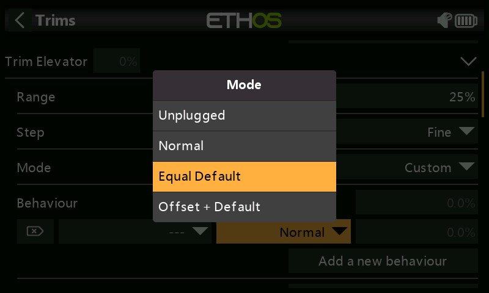
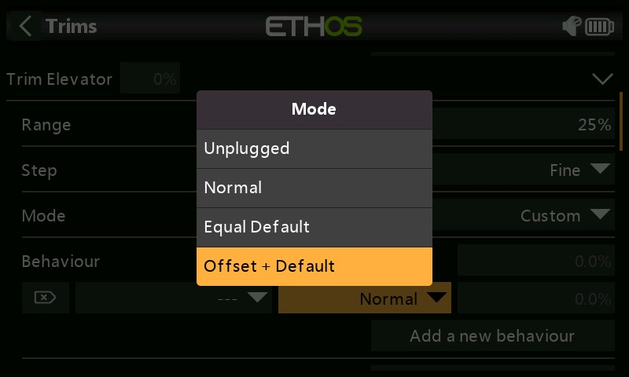
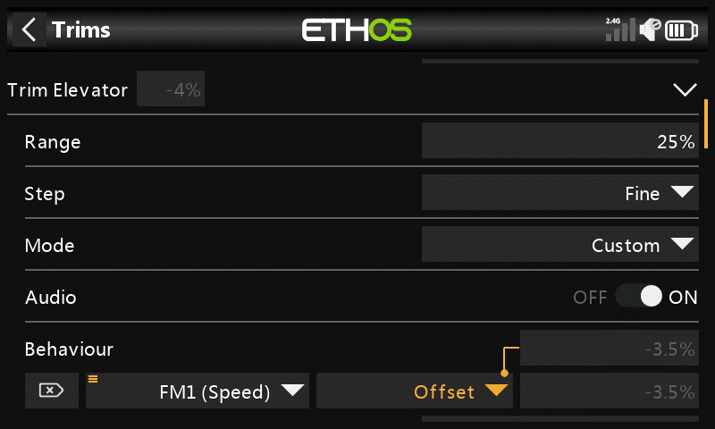
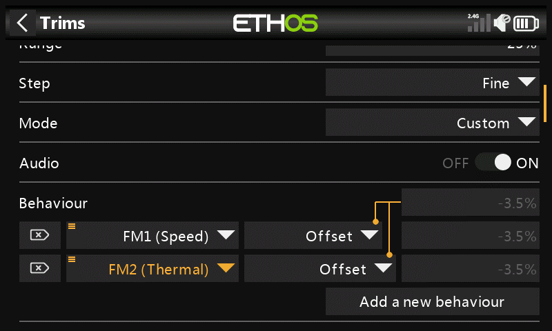
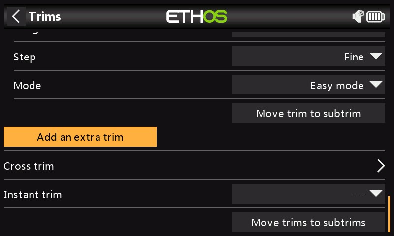

# Trims

.jpeg>)

La section Trims vous permet de configurer la plage de trim et la taille du pas de trim, ou de configurer un comportement de trim personnalisé pour chacun des 4 manches de commande. Il permet également de configurer des raccords croisés et des raccords instantanés.

Les X20 Pro/R/RS et la X18 disposent de deux inters de trim supplémentaires, T5 et T6, qui sont très utiles pour les réglages en vol.

Des trims supplémentaires peuvent être configurées selon les besoins.

.png>)

Il existe un ensemble de paramètres de coupe pour chaque manche.

.jpeg>)

Les X20 Pro et x18 ont deux versions supplémentaires T5 et T6.

**Configuration des trims**

**Intervalle**

La plage de réglage par défaut est de +/- 25 %. La portée peut être modifiée pour couvrir jusqu'à la plage complète du manche de 100 %. Des précautions doivent être prises avec cette option, car maintenir les compensateurs trop longtemps pourrait ajouter tellement de trim que rendre votre modèle impossible à piloter.

Notez que sur l'écran principal, la plage de réglage par défaut est indiquée comme -100 à 100. Une plage de trim de 100 % affichera -400 à 400 (c'est-à-dire 4 fois la plage de trim normale).

**Répétition**

.jpeg>)

Le paramètre d'étape d'ajustement permet de désactiver les ajustements ou de configurer la granularité du pas d'ajustement, de « Extra fin » à « Fin », Moyen, Grossier, Exponentiel ou Personnalisé.

Le réglage exponentiel donne des pas fins près du centre et des pas grossiers plus loin. Personnalisé permet de spécifier l'étape de raccord sous forme de pourcentage.

Avec une plage par défaut de 25 %, les étapes de découpage par clic sont les suivantes :

Extra-fin 0.5us

Bien 1us

moyen 2us

Grossier 4us\
Exponentiel 0.3us à 16us

Pour les raccords personnalisés et une plage par défaut de 25 %, les étapes de raccord par clic sont les suivantes :

Taille du pas 1% 1us\
Taille du pas 100% 128us par pas

Pour les découpes personnalisées et une plage de 100 %, les étapes de découpage par clic sont les suivantes :

Taille du pas 1% 5us

Taille du pas 100% 512us par pas

**Mode**

.png>)

Par défaut, les trims sont toujours activés, mais les options de comportement de trim peuvent être configurées pour modifier le comportement de trim en fonction de diverses conditions.

Remarque : Les trims sont réinitialisés à 0 lorsque le mode est modifié.

Il existe quatre modes de comportement de trim :\

**OFF**

.png>)

Lorsque le mode de trim est désactivé, le trim est désactivé.

Par exemple, sur les modèles électriques, le trim d'accélérateur n'est pas nécessaire et peut être désactivé en réglant le mode sur OFF. Le trim peut ensuite être réutilisé pour ajuster une Var, Veuillez-vous référer à redéfinir trim dans la section Vars.

**Mode simple**

.jpeg>)

En mode simple, il n'y a qu'une seule valeur de trim pour chaque commande, de sorte que la valeur de trim est partagée entre tous les modes de vol. Ceci est généralement approprié pour le trims des ailerons et de la dérive, car ces trims ne varient généralement pas selon les modes de vol.

**Trim par phase de vol.**

.jpeg>)

Avec l'option « Trim indépendant par mode de vol », le trim n'affecte que le mode de vol actif. Cette option est normalement utilisée pour le compensateur de profondeur, car le compensateur de profondeur requis varie généralement pour chaque mode de vol en raison, par exemple, de différences de carrossage de l'aile. En fait, c'est souvent la raison principale de la mise en place de modes de vol !

**Perso**

.jpeg>)

En mode Perso, le comportement de raccord peut être personnalisé

.png>)

Une fois le mode Perso sélectionné, une nouvelle boîte de dialogue « Comportement » apparaît. Cliquez sur « Ajouter un nouveau comportement ».

.png>)

Une nouvelle ligne de comportement sera ajoutée.

Les options de comportement initiales sont les suivantes :

* Déconnecté
* Normal
* Défaut égal
* Décalage + par défaut

Chacune des options est décrite ci-dessous.

Désactiver les trims

.jpeg>)

Les trims peuvent être désactivés en configurant l'option « Déconnecté ».

.png>)

Les trims peuvent être désactivés de manière sélective en passant de « Toujours activé » à la condition souhaitée.

Égal (à un autre trim)

L'ajustement d'une condition spécifique peut être configuré pour être égal à l'ajustement d'une autre condition.

Décalage + (une autre trim)

L'ajustement d'une condition spécifique peut être configuré pour être ajouté à l'ajustement d'une autre condition.

Exemple de trim décalé

Sur de nombreux modèles, vous souhaitez disposer d'un compensateur de profondeur de base lorsqu'il vole dans sa phase de vol par défaut, puis d'avoir des paramètres de trim de profondeur dépendant des autres phases de vol.

À titre d'exemple, sur les planeurs, la valeur par défaut est normalement un mode de vol appelé Croisière, où la profondeur est d'abord réglée pour le vol en palier.

.png>)

La valeur par défaut du compensateur de profondeur de 0,0 % dans la capture d'écran ci-dessus est le compensateur de croisière.

Ensuite, vous voulez des trims de profondeur dépendantes dans d'autres modes de vol tels que la vitesse et le thermique.

Nous commençons par appuyer sur « Ajouter un nouveau comportement ».

.png>)

La capture d'écran ci-dessus montre la nouvelle ligne de comportement par défaut.

Nous configurons le premier comportement comme 'Décalage + Par défaut' avec la condition 'FM1(Vitesse)'.

Lorsque le mode FM1 (Vitesse) est sélectionné, tous les réglages de trim sont enregistrés en tant que décalage par rapport à la valeur de trim du mode de base dans FM0 (Cruise). Par conséquent, le trim en FM1 (Speed) sera séparé mais aussi dépendant du trim de base.

.jpeg>)

Notez que lorsque nous configurons le deuxième comportement, nous obtenons maintenant des options supplémentaires 'Equal FM2(Speed)' et 'Offset + FM2(Thermal)' dans la boîte de dialogue déroulante. Ceux-ci sont dus au premier comportement que nous avons configuré ci-dessus.

Nous configurons le deuxième comportement comme 'Offset + Default' avec condition

'FM2(Thermique)'. Lorsque le mode FM2 (Thermique) est sélectionné, tous les réglages de trim sont enregistrés en tant que décalage par rapport à la valeur de trim du mode de base dans FM0 (Cruise). Par conséquent, le trim en FM2 (Thermique) sera séparé mais dépendra également du trim de base.

Si votre assiette de croisière de base doit être modifiée parce que vous avez modifié le centre de gravité de l'aile, les paramètres de trim dépendants de la vitesse et de la thermique seront également modifiés de la même manière.

**Audio**

Pour chaque trim, l'audio peut être désactivé si les annonces de trim standard ne sont pas souhaitées, par exemple si le trim a été réutilisé.

**Trims supplémentaires**

Des trims supplémentaires peuvent être créées en appuyant sur le bouton « Ajouter une trim supplémentaire ».

_**Nom**_

La nouvelle trim peut être nommée.

_**En haut**_

Sélectionnez la source à utiliser pour augmenter la valeur de raccord.

_**En bas**_

Sélectionnez la source à utiliser pour diminuer la valeur de raccord.

_**Intervalle**_

Veuillez-vous référer à la description de la gamme pour les versions standard ci-dessus.

_**Répétition**_

Veuillez-vous référer à la description de l'étape pour les trims standard ci-dessus.

_**Mode**_

Veuillez-vous référer à la description ci-dessus pour configurer le comportement des trims standard.

**Trim croisés**

Des trims croisés peuvent être configurées pour chaque manche de trim, de sorte que vous pouvez désigner l’inter de trim à utiliser pour chaque manche. (Les versions T5 et T6 ne sont disponibles que sur les X20 Pro et X18.)

**Trim instant**

Lorsque cette fonction passe à l'état actif, elle ajoute les positions actuelles des manches aux valeurs d'ajustement respectives pour les ajustements par défaut (également les ajustements croisés). Il est préférable de l'attribuer à un interrupteur que vous pouvez atteindre sans lâcher les manches, qui est ensuite utilisé pour régler instantanément les trims tout en volant droit et à niveau. Cela évite d'avoir à appuyer frénétiquement plusieurs fois sur les inters de trim si les trims sont éloignés. Ce paramètre doit être désactivé après le vol de découpage, afin d'éviter de perturber à nouveau accidentellement les découpages.

**Déplacer trims vers des subtrims**

Appuyez sur « trim vers subtrim » pour prendre les trims du mode de vol actuellement sélectionné, transférer leur contenu vers les sous-trims, réinitialiser les trims et ajuster les trims de tous les autres modes de vol. Si vous êtes sur le point de manquer de trim, au lieu d'avoir à ajuster chaque valeur l'une après l'autre, cela se fait automatiquement avec cette fonction. Si possible, il serait plus sage de corriger le problème mécaniquement, en particulier avec des valeurs élevées, car l'ajustement du sous-trim qui en résulte peut entraîner des problèmes dus à des projections très asymétriques.
