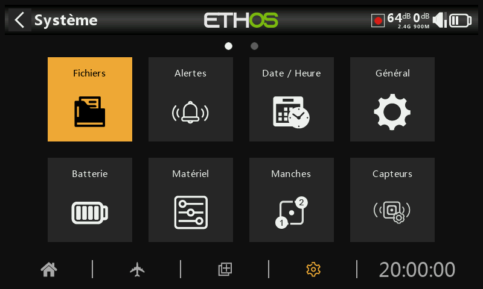

# Configuration du système

Ce menu est utilisé pour configurer les paramètres de la radio communs à tous les modèles. Il est accessible en appuyant sur l'icone "Engrenage" en bas à droite de l'écran, ou en appuyant sur le bouton \[SYS]. La configuration spécifique d'un modèle est effectuée via l'icone "Avion",en bas à gauche de l'écran ou via le bouton \[MDL].

NB: La configuration du système HF étant spécifique à chaque modèle, reportez-vous à la section correspondante "Système RF"» du menu Modèle.

Sur la page de "Système", appuyez sur l'icone pour configurer la section sélectionnée ou utilisez le sélecteur rotatif pour déplacer la surbrillance vers l'icone souhaitée, puis appuyez sur Entrée. Un balayage vers la gauche de l'écran permet l'accès à la seconde page de configuration ou utiliser le sélecteur rotatif pour déplacer la surbrillance vers la deuxième page.

**Gestionnaire de fichiers**

Le gestionnaire de fichiers permet de gérer les fichiers des différents espaces de stockage de la radio.

**Alertes**

Configuration du mode silencieux, des tensions de la batterie radio et RTC, des conflits de capteurs et des alertes d'inactivité.

**Date et heure**

Configuration de l'horloge système et des options d'affichage de l'heure.

**Généralités**

Pour configurer le style de menu, la langue du système et les attributs de l'écran LCD tels que la luminosité et le rétroéclairage, ainsi que les modes et paramètres audio, vario et haptique. De plus, les options de la barre d'outils supérieure, la sélection du modèle à la mise sous tension et la présélection du mode USB peuvent être configurées.

**Batterie**

Configuration des paramètres de gestion de la batterie.

**Matériel**

Cette section permet de vérifier les périphériques d'entrée physiques matériels, ainsi que l'étalonnage des entrées analogiques et du gyroscope. Il permet également de modifier les affectations des inters et de définir les fonctions du bouton d'accueil.

**Manches**

Configuration du mode manches et de l'ordre des voies par défaut. Les 4 manches peuvent également être renommées.

**Capteurs**

Outils de configuration d'appareils tels que les capteurs, les récepteurs, la suite de gaz, les servos et les émetteurs vidéo.

**Info**

Informations système pour la version du micrologiciel, les types de cardans et les modules RF.
