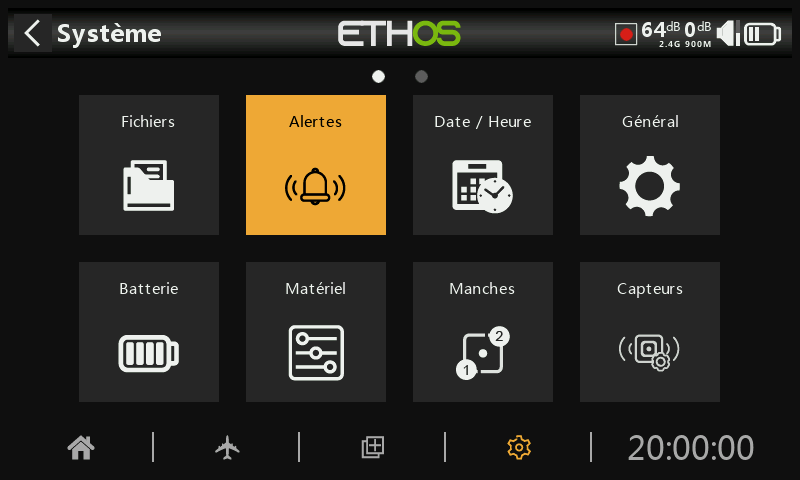

## Alertes

Les alertes système sont les suivantes :

### Silencieux

Une alerte « Mode silencieux » est émise au démarrage lorsque la vérification « Mode silencieux » est activée et que le « Mode audio » a été réglé sur Silencieux en mode Système / Général / Audio

### Tension radio

Une alerte vocale « Batterie radio faible » est émise lorsque la vérification de la « Tension radio » est activée et que la batterie de la radio principale est inférieure au seuil défini dans le paramètre « Alerte tension basse » dans Système / Batterie. Il est conseillé de se poser rapidement dans le cas d'un vol.

### Tension pile RTC

Une alerte vocale « Batterie RTC faible » est émise lorsque la vérification de la « Tension pile RTC » est activée et que la pile bouton RTC est inférieure à 2,5 V, le seuil de batterie RTC par défaut (non définissable). L'alerte peut être désactivée mais il est conseillé de changer la pile RTC rapidement (pile CR2020). En effet, le système a besoin des infos de temps pour l'enregistrement des données et une heure invalide rendra difficile l'analyse de ses données (jour et heure de vol par exemple).

### conflit capteurs

La détection des conflits de capteurs peut être désactivée. Cela peut s'avérer nécessaire que si vous avez des capteurs qui ne répondent pas à la spécification S.Port de FrSky ou bien des capteurs avec des conflits d'identification.

### Inactivité

Une alerte vocale « Radio inactive » est émise lorsque la radio n'a pas été utilisée pendant plus longtemps que la durée « Inactivité », ainsi qu'une vibration au cas où le volume de la radio serait complètement baissé. La valeur par défaut est de 10 minutes.
