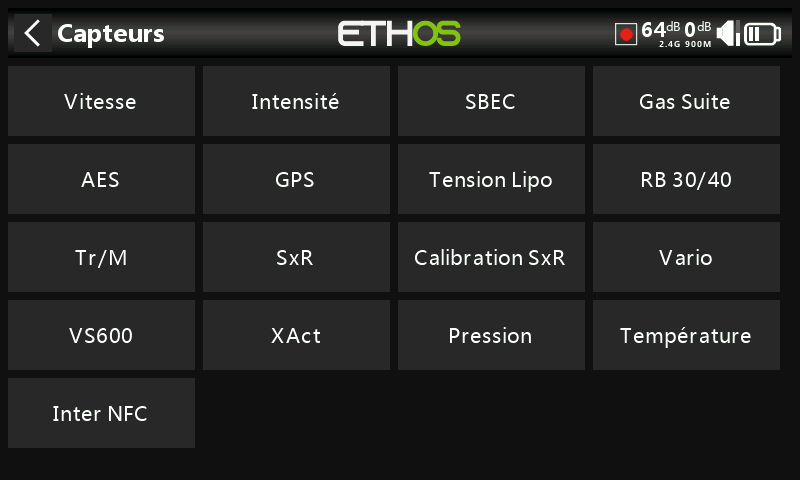

## Capteurs

Frsky propose une série de capteurs et périphériques qui sont paramétrables par Ethos. 

Les capteurs / périphériques suivants sont actuellement pris en charge :

* Vitesse
* Intensité
* Le SBEC
* Gaz suite
* GPS
* Tension Lipo
* RB 30/40
* RPM (Tr / min)
* SxR
* Calibration SxR
* Variomètre
* Émetteur vidéo VS600
* Servos XAct
* Pression
* Température
* Inter NFC à distance

NB : Référez-vous  au manuel de chaque capteur / périphérique pour les options disponibles.

Veuillez noter que l'écran « Configuration de l'appareil » d'ETHOS vous permet de modifier les ID physiques du capteur S.Port et les ID d'application. Si vous avez plusieurs appareils qui ont la même fonction, vous devez les connecter un par un, les découvrir dans Télémétrie / « Découvrir de nouveaux capteurs », puis dans « Configuration de l'appareil », modifier l'ID physique et l'ID d'application, puis revenir en arrière et les redécouvrir avec le nouvel ID. Reportez-vous à la section Télémétrie SmartPort.

### Sélection du module
Choix du module RF à utiliser pour la configuation du capteur / Périphérique

Les options de sélection du module à utiliser sont les suivantes :
Les deux modules RF
Module RF interne
Module RF externe
Connecteur S.Port sur la radio.

