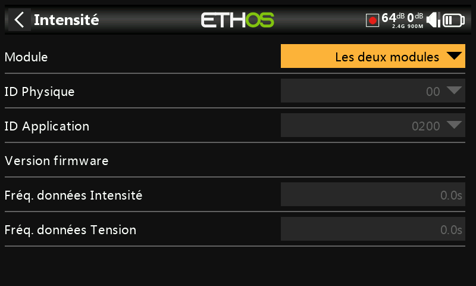

## Capteurs

La page "capteurs" permet de configurer des périphériques FrSKy tels que des capteurs, des récepteurs avec Gyro intégré, le GasSuite, des servos, des émetteurs vidéo, etc...

Les capteurs / périphériques suivants sont actuellement pris en charge :

* Vitesse
* Intensité
* Le SBEC
* Gaz suite
* GPS
* Tension Lipo
* RB 30/40
* RPM (Tr / min)
* SxR
* Calibration SxR
* Variomètre
* Émetteur vidéo VS600
* Servos XAct
* Pression
* Température
* Inter NFC à distance

Veuillez vous référer au manuel de l'appareil pour plus de détails.

Veuillez noter que la page « Capteurs » permet la modification des adresses physiques d'un capteur S.Port et des adresses d'application. Si vous avez plusieurs périphériques / Capteurs ayant les mêmes adresses, vous devez les connecter un par un, les découvrir dans la configuration du modèle / " Télémétrie / Découverte capteurs ", puis dans « Capteurs », modifier l'ID physique et l'ID d'application, puis revenir en arrière et les redécouvrir avec le nouvel ID. Reportez vous à la section Télémétrie S.Port.

Exemple de configuration du capteur d'intensité :

La configuration du capteur peut-être effectué via un ou des modules RF ou via la prise S.Port de la radio.

