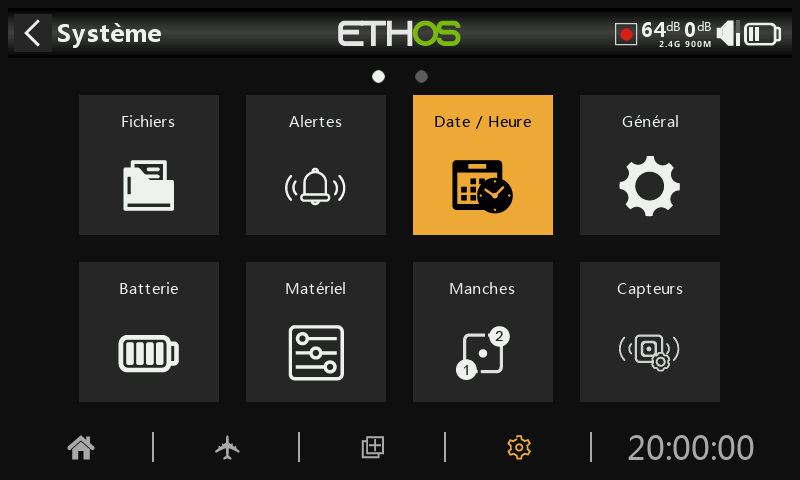
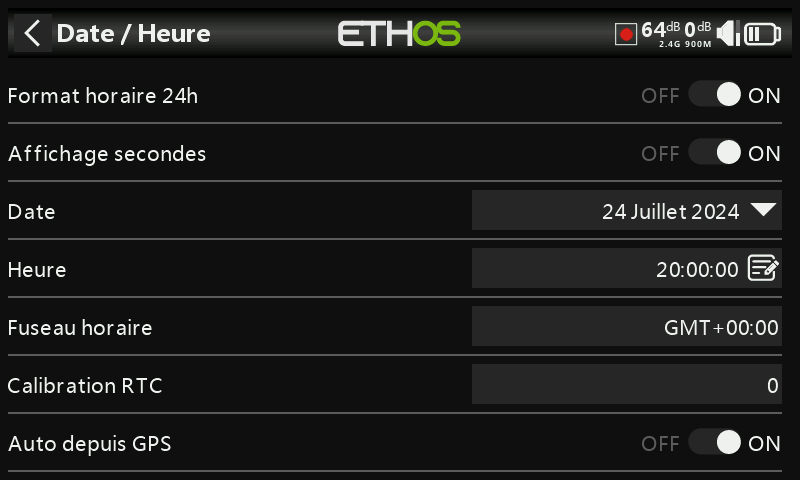

## Date / Heure

### Format horaire 24h

Affichage de l'heure au format 12h ou 24h. le format est 24h lorsque l'option est activée.

### Affichage des secondes

Affichage des secondes de l'heure lorsque l'option est activée.

### Date

Réglage de la date du jour. Sauvegardée grâce à l'horloge temps réél interne (RTC). La date sera utilisée lors de la création des enregistrements des données.

### Heure

Réglage de l'heure actuelle. Comme la date, elle sera utilisée lors des enregistrements de données.

### Fuseau horaire

Configuration de fuseau horaire de l'utilisateur.

### Calibrage RTC

L'horloge en temps réel (RTC) nécessite une calibration pour compenser une dérive de l'horloge pouvant atteindre 41 secondes par jour.

Pour la calibration, calculez combien de secondes votre horloge gagne ou perd en 24 heures.

Réglez cette valeur de calibration sur 12 fois ce nombre de secondes, valeur négative si votre horloge est plus rapide et positive si plus lente. Pour une meilleure précision, il sera peut-être nécessaire d'ajuster ce paramètre. La plage de valeur de calibration est -500 / +500.

### Auto depuis GPS

Lorsqu'elle est activée, l'heure et la date seront automatiquement réglées à partir des données du capteur GPS si ce dernier est installé.
