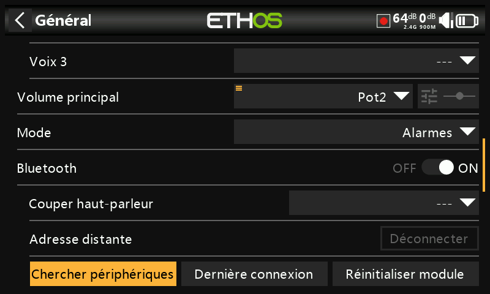

## Général

Les éléments suivants peuvent être configurés ici :

* Affichage
* Les paramètres audio
* Les réglages vario
* Les paramètres de retour vibreur
* La barre d'outils supérieure

### Affichage

#### Langue

Les langues suivantes sont prises en charge pour les menus de la radio :

* English
* 中文
* Česky
* Deutsch
* Español
* Français
* עִברִי*
* Italiano
* Nederlands
* Norsk
* Português Brasileiro
* Polish
* Português

#### Clavier

Choix de la disposition du clavier virtuel parmis QWERTY, QWERTZ et AZERTY.

#### Luminosité

Ajustement de la luminosité de l'écran en utilisant le curser. Les options sont accessibles par un appui long sur le champ ou sur [Enter] lorsque le champ est en surbrillance. 3 choix possibles pour les réglages de luminosité : minimum / maximun ou une source ( pot / curseur ).

NB: si Luminosité (pour le rétroéclairage activé) = « Luminosité veille » (pour le rétroéclairage désactivé), l'écran tactile reste actif.

Exemple pour l'utilisation d'un potentiomètre pour régler la luminosité de l'écran :

Appuyez sur « Utilisation source », puis sélectionnez un potentiomètre à utiliser comme contrôle de la luminosité.

L'exemple ci-dessus montre que la luminosité est contrôlée via le potentiomètre sur le côté droit de la radio.

#### Activation (de l'écran après la mise en veille)

L'activation de l'écran suite à la mise en veille est possible selon les options ci-dessous :

* Toujours : l'écran reste activé en permanence.
* Manches : l'écran s'active lorsque vous actionnez des manches ou des touches.
* Inters : l'écran s'active lorsque des interrupteurs ou des touches sont actionnés.
* Gyro : l'écran s'active lorsque vous inclinez la radio ou lorsque vous actionnez les touches.

NB : plusieurs options peuvent être sélectionnées simultanément.

#### Mise en veille

Durée d'inactivité avant la mise en veille de l'écran. Si « Toujours » est activé dans les options activation, ce paramètre n'est pas modifiable.

#### Luminosité veille

Ajustement de la luminosité de l'écran en mode veille. Les options sont identiques au règlages de luminosité en début de chapitre.

NB : Luminosité (pour le rétroéclairage activé) = « Luminosité du mode veille » (pour le rétroéclairage désactivé), l'écran tactile reste actif.

#### Mode sombre

Choix entre les modes clair ou sombre de l'affichage.

#### Couleur de surbrillance

Choix de la couleur de surbrillance des champs sélectionnés. La valeur par défaut est jaune (#F8B038).

### Emplacement de stockage (X18(S), XE(S) et X20 Pro/R/RS)

Les radios X18(S), XE(S) et X20 Pro/R/RS disposent d'une carte eMMC (MultiMediaCard intégrée) de 8 Go qui est un périphérique de stockage composé d'une mémoire flash NAND et d'un simple contrôleur de stockage. Le système ETHOS sélectionne par défaut le stockage eMMC (Radio), ce qui rend l'utilisation de la carte SD facultative. Cependant, l'utilisateur peut choisir d'utiliser une carte SD pour l'un ou l'autre des répertoires utilisateurs.

Si le choix se porte sur l'utilisaton de la carte SD, tous les fichiers et dossiers copiés sur la carte SD avant d'effectuer la sélection. Il en va de même pour l'audio et les bitmaps.

### Audio

Un choix de 3 voix est à votre disposition, une voix principale et deux voix secondaires.

La voix "Voix 1 (Princ.)" est la voix principale. Elle est utilisée pour toutes les annonces système Ethos.

Par défaut, pour le français, vous avez le choix entre une voix féminin et une voix masculine. Dans l'exemple ci-dessus, la voix féminine a été sélectionnée comme voix principale.

Les fichiers correspondants se trouvent dans les dossiers suivants :

* /audio/fr/femme/system pour la voix "femme"
* /audio/fr/homme/system pour la voix "homme"

Fichiers audio de l'utilisateur

Les fichiers audios de l'utilisateur proposés par la fonction spéciale « Lire séquence » doivent être stockés dans les répertoires suivants :

* /audio/fr/femme pour la voix "femme"
* /audio/fr/homme pour la voix "homme"

Des packs de voix alternatives peuvent être installés en tant que "Voix" 2 ou "Voix 3".

Pour garantir la sortie vocale appropriée pour "Voix 2" ou "Voix 3", vous devrez ajouter vos fichiers audio personnalisés dans une structure de dossiers similaire à celles standard présentées ci-dessus. Par exemple, si vous utilisiez TTS et une voix appelée Susan, votre structure de dossiers serait la suivante :

* /audio/fr/Susan pour les fichiers audio de l'utilisateur
* /audio/fr/Susan/system pour les fichiers audio système

Veuillez noter que chaque voix doit avoir un dossier /system, contenant les fichiers audio nécessaires pour les annonces de la valeur de jeu et de le chrono. Une liste des fichiers audio système fournis en standard est incluse sous forme de fichier .csv avec chaque version audio.

Utilisez le curseur de "Volume principal" pour contrôler le volume audio. Un appui long sur \[ENT] permet d'utiliser un potentiomètre (comme pour la luminosité écran). Les bips pendant le réglage aident à juger du volume.

Les modes audio permettent de contrôler quand les annonces seront jouées automatiquement par Ethos :

* Silencieux : Pas d'audio. Notez qu'une alerte sera émise au démarrage si la vérification du « mode silencieux » dans Système / Alertes est activée

* Alarmes uniquement : Seules les alarmes seront jouées

* Par défaut : Les sons sont activés.

* Fréquent : Il y aura également des bips d'erreur lorsque vous tenterez de dépasser la valeur maximale ou minimale sur les nombres modifiables

* Toujours : En plus des sons dans « Souvent », il y aura également des bips lors de la navigation

#### Bluetooth (X20S/HD/Pro/R/RS)

Les modèles X20S, HD et X20 Pro/R/RS disposent d'un mode audio supplémentaire pour relayer l'audio vers un appareil Bluetooth comme un casque.

Appuyez sur « Chercher périphériques ».

Le message « En attente périphériques ... » s'affiche. Allumez votre appareil Bluetooth et placez-le en mode d'appairage. Une fois le périphérique Bluetooth trouvé, son nom s'affiche. Touchez-le pour sélectionner l'appareil.

Le message « En attente de l'appareil » s'affiche.

Lorsque la radio et l'appareil sont couplés, le message « Appareil Bluetooth connecté » s'affiche. Appuyez sur OK.

#### Mise en sourdine du haut-parleur

Pour couper le son du haut-parleur du système (par exemple lors de l'utilisation d'un écouteur BT), sélectionnez l'option Toujours allumée, ou activée uniquement lorsque la télémétrie est active, ou contrôlée par une source telle qu'un inter ou toute autre condition.

Le système se souvient de l'appareil Bluetooth. Pour un fonctionnement normal, allumez la radio, puis l'appareil Bluetooth. L'appareil Bluetooth se connectera, ce qui prendra quelques secondes pour que la sourdine du haut-parleur s'active à nouveau.

### Vario

Les caractéristiques audio des tonalités vario peuvent être configurées ici :

* Volume : volume relatif du vario
* Tonalité zéro : fréquence de la tonalité lorsque le taux de montée est nul
* Tonalité max : fréquence de la tonalité à la vitesse de montée maximale
* Répétition : délai entre les bips à la tonalité zéro

Reportez-vous au capteur VSpeed dans Télémétrie et à la fonction spéciale "Vario" pour d'autres paramètres Vario.

### Vibreur

* Intensité: intensité des vibrations haptiques.
* Mode : modes (similaires aux modes audio ci-dessus) 

### Barre d'infos supérieure

* Affichage numérique : L'état de la batterie dans la barre d'outils supérieure peut être modifié à partir de l'affichage de la barre par défaut pour afficher la tension de la batterie radio sous forme de valeur numérique à la place.

* RSSI numérique :  De même, l'état RSSI peut être modifié d'un affichage à barres à une valeur numérique pour 2,4G et 900M.

### Choix modèle au démarrage

Lorsque cette option est activée, l'écran de sélection du modèle s'affiche à la mise sous tension, de sorte qu'un modèle peut être choisi avant que les alertes de la liste de contrôle du modèle précédemment sélectionné ne s'affichent. Cela évite d'avoir à annuler les alertes de la liste de contrôle avant de sélectionner un autre modèle.

Par défaut, le dernier modèle utilisé dans la session précédente est mis en surbrillance pour la sélection.

### Présélection du mode USB

Les présélections suivantes sont disponibles lorsque la radio est connectée à un PC via un câble USB :

* Non défini : Si ce mode est choisi, une boîte de dialogue apparaîtra au moment de la connexion pour qu'une sélection soit effectuée à ce moment-là.
* Joystick : Lors de la connexion, la radio entrera automatiquement en mode joystick pour une utilisation avec un simulateur RC.
* Ethos Suite : Lors de la connexion, la radio entrera automatiquement en « mode Ethos » pour la communication avec Ethos Suite. Veuillez-vous référer au mode Ethos dans la section Ethos Suite.
* Série : Lors de la connexion, la radio entrera automatiquement en mode série, dans lequel les traces de débogage Lua sont envoyées à USB-série s'il y en a. La vitesse de transmission est de 115200 bps. Un pilote de port COM virtuel Windows approprié peut être trouvé [ici](https://www.st.com/en/development-tools/stsw-stm32102.html).
