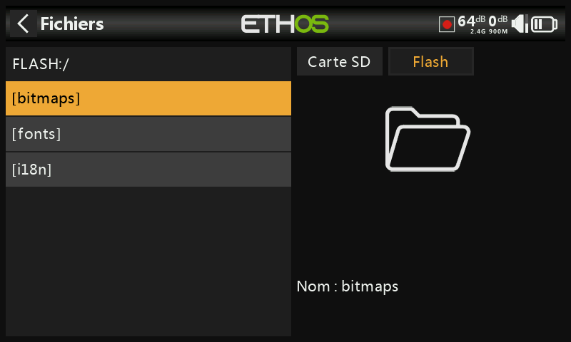
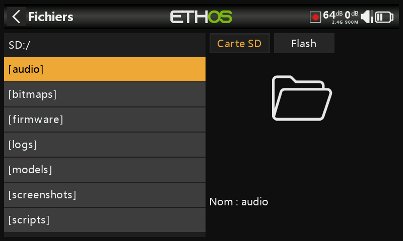
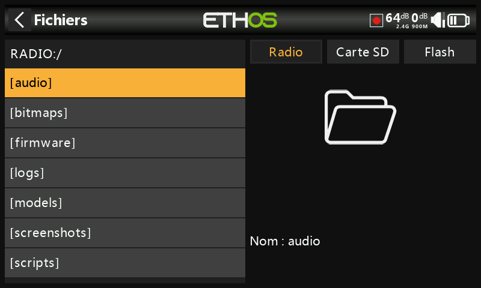
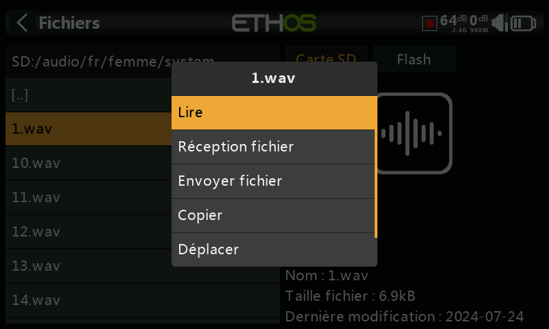
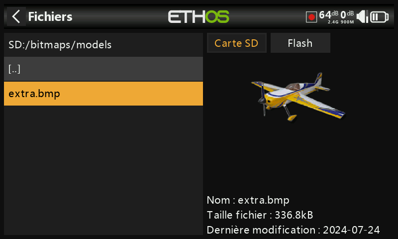
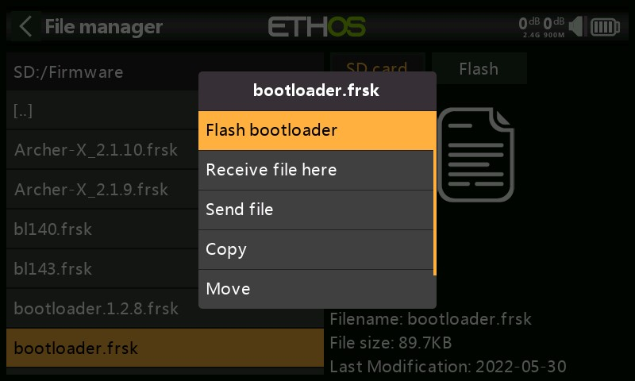

# Gestionnaire de fichiers

Le gestionnaire de fichiers permet de gérer les fichiers des différents espaces de stockage de la radio (Flash / Carte SD / Stockage interne). Il est possible de passer en revue les répertoires dans ces espaces de stockage, de sélectionner n'importe quel fichier. En fonction du type du fichier sélectionné, il est possible d'exécuter différentes actions (visionner un texte, un enregistrement de logs ou une image, flasher un module, un récepteur ou un capteur de télémétrie, écouter un fichier audio, etc.)

ETHOS dispose d'une fonction de transfert de fichiers Bluetooth radio-radio. Reportez-vous à l'exemple de la section Partage de fichiers via Bluetooth ci-dessous.

Appuyez sur « Fichiers » pour ouvrir l'explorateur de fichiers.

## Le disque Flash

Le radio utilise un stockage interne pour conserver les bitmaps et les polices du système. Appuyez sur l'onglet « Flash » pour l'explorer :

Répertoires du disque "Flash" :

* bitmaps/system : les bitmaps / icônes utilisées pour le système
* fonts : les fontes additionnelles
* i18n : les traductions du système

## Les disques SD et Radio

La série X20/S/HD nécessite une carte SD de 32 Go ou moins formatée en FAT32. Les cartes SanDisk Ultra Micro SDHC Class 10 32 Go sont une bonne option.

Les radios Twin XLite, X14, X18, XE et X20 Pro/R/RS utilisent une carte eMMC interne pour le stockage des fichiers par défaut, mais une carte SD externe peut être ajoutée. Appuyez sur l'onglet « Radio » pour explorer la mémoire de la carte eMMC.

Le système créera certains des dossiers si l'utilisateur ne les crée pas, comme les répertoires "log" (enregistrements), "models" (modèles) et "screenshots" (captures d'écran). Le dossier "firmware" a été créé manuellement pour conserver les firmware des modules / récepteurs / capteurs de télémétrie / etc.

Répertoires des disques "SD" et "Radio" :

### Le répertoire "audio"

Le répertoire "audio" contient les fichiers audio réparties par voix, par exemple :

   **audio/fr/femme** : Voix féminine

   **audio/fr/homme** : Voix masculine

Ces dossiers sont destinés aux fichiers audios de l'utilisateur, qui peuvent être lus par la fonction spéciale « Lire audio ». Reportez-vous à la section Modèle / Fonctions spéciales et aussi la section Choix des voix.

Le format doit être 16 kHz ou 32 kHz PCM linéaire 16 bits ou alaw (EU) 8 bits ou mulaw (US) 8 bits. Les noms des fichiers wav doivent avoir au maximum 31 caractères (extension comprise).

Les sous-répertoires "system" sont destinés aux fichiers audios du système, par exemple :

   **audio/fr/femme/system** : Fichiers système de la voix féminine

   **audio/fr/homme/system** : Fichiers système de la voix masculine

Ces fichiers sont listés dans le CSV associé à chaque langue. Par exemple :

| hello.wav | Le message d'accueil « Bienvenue dans Ethos »                                             |
| --------- | ----------------------------------------------------------------------------------------- |
| bye.wav   | Non fourni par Ethos, mais vous pouvez ajouter votre propre fichier WAV d'adieu. |

Appuyez sur le dossier \[audio] pour afficher le contenu du dossier. Puis sélectionnez un fichier et appuyez sur [Enter long] pour afficher le menu contextuel :

Pour l'écouter, choisissez l'option "Lire".

Le fichier peut également être copié, déplacé ou supprimé. Il existe également des options pour envoyer ou recevoir le fichier via Bluetooth. Veuillez-vous référer à la section Partage de fichiers via Bluetooth ci-dessous.

*Remarque : Les trois dossiers sont mis à jour par Ethos Suite, quel que soit le dossier que vous avez sélectionné dans les options vocales.*

### Le répertoire "bitmaps"

Ce dossier est destiné aux fichiers images :

* Le dossier **bitmaps/models** est destiné aux images de modèles pouvant être utilisées dans « Modèle / Modifier le modèle » et les assistants de nouveau modèle :

* le dossier **bitmaps/user/** est destiné aux images pouvant être utilisées par le Widget "Bitmap"

* le dossier **bitmaps/map/** est destiné aux images pouvant être utilisées par le Widget "Carte GPS"

Le format d'image recommandé est le format BMP suivant :

* BMP 32 bits
* 8 bits par couleur
* Canal alpha (utilisé pour la transparence de l'image)
* Taille : taille du widget où l'image est affichée

Ce format réduit la charge de calcul sur le microcontrôleur embarqué de la radio. De plus, ETHOS redimensionnera les BMP à la volée, contrairement aux formats PNG ou JPG.

Règles de nommage des fichiers image :

* N'utilisez que les caractères suivants : A-Z, a-z, 0-9, () !-\_@# ; \[]+= 
* Le nom ne doit pas contenir plus de 11 caractères, plus 4 pour l'extension. Si le nom comporte plus de 11 caractères, il s'affiche dans le Gestionnaire de fichiers, mais n'apparaît pas dans l'interface de sélection d'image.

Ethos Suite possède un module pour la conversion des images au format de la radio.

### Le répertoire "documents"

Ce dossier est destiné aux documents.

* Le dossier **documents/user** est destiné aux documents texte de l'utilisateur. Ils peuvent être appelés dans le widget "Texte".

### Le répertoire "firmware"

Ce dossier est destiné aux fichiers du micrologiciel. Les mises à jour du micrologiciel pour le module RF interne, les modules externes et d'autres appareils tels que les récepteurs, etc. sont stockées ici. Ils peuvent ensuite être flashés à partir d'ici via le S.Port externe de la radio, ou OTA (Over The Air). Le nouveau firmware doit être copié dans le dossier Firmware après avoir placé la radio en mode bootloader et connecté à un PC via USB.

.jpeg>)

Appuyez sur le dossier Firmware pour afficher les fichiers du firmware qui ont été copiés dans ce dossier. Appuyez ensuite sur l'option Flash dans la boîte de dialogue contextuelle. L'exemple ci-dessus montre le module RF interne en cours de mise à jour.

.jpeg>)

L'exemple ci-dessus montre un récepteur S8R sur le point d'être mis à jour via la connexion S.Port de la radio.

.jpeg>)

L'exemple ci-dessus montre un récepteur TD-R18 sur le point d'être mis à jour Over-The-Air via la liaison sans fil vers le récepteur lié.

L'exemple ci-dessus montre la mise à jour du bootloader de la radio.

Les fichiers peuvent également être copiés, déplacés ou supprimés.

### Le répertoire "i18n"

Ce dossier contient les fichiers de traduction de la langue.

### Le répertoire "logs"

Les journaux de données y sont stockés.

### Le répertoire "models"

La radio stocke les fichiers de modèles ici. Ces fichiers ne peuvent pas être modifiés par l'utilisateur, mais peuvent être sauvegardés ou partagés à partir d'ici. Initialement, les modèles étaient simplement nommés à partir de model01.bin, mais à partir d'Ethos v1.2.11, le nom du modèle est utilisé, par exemple un modèle nommé 'Extra' aura un nom de fichier de 'Extra.bin'. S'il y a plus d'un 'Extra', les modèles supplémentaires seront nommés 'Extra01.bin', etc.

Lors de la modification des noms de modèle dans l'écran « Modifier le modèle », le nom de fichier du modèle (.bin) sera également modifié. Le nom de fichier du modèle sera en minuscules (le nom réel du modèle avec les majuscules et les minuscules est enregistré dans le \*\*\*.bin). Tous les caractères ne sont pas pris en charge pour le nom de groupe du fichier modèle, il est donc possible qu'il ne corresponde pas exactement au nom du modèle.

À partir de la version 1.1.0 Alpha 17, il existe des sous-dossiers pour chaque dossier de catégorie de modèle créé par l'utilisateur.

### Le répertoire "screenshots"

Les captures d'écran créées par la fonction spéciale Capture d'écran sont stockées ici. Reportez-vous à la section Modèle / Fonctions spéciales .

### Le répertoire "scripts"

Ce dossier est utilisé pour stocker les scripts Lua. Les scripts peuvent être organisés dans des dossiers individuels.

Veuillez noter que les scripts Lua augmentent le temps de démarrage de la radio. S'ils sont mis en œuvre correctement, le retard ne devrait pas être perceptible, mais si ce n'est pas le cas, le retard peut être presque indéfini.

Chaque module externe tiers possède son propre fichier Lua et doit être stocké dans son propre dossier.\
scripts/multi\
scripts/elrs\
scripts/ghosts\
scripts/crossfire

Veuillez-vous référer à la section [Modules externes tiers](https://www.rcgroups.com/forums/showpost.php?p=49550649\&postcount=18844) postez sur le fil X20 et Ethos sur rcgroups pour plus d'informations.

### Le fichier "radio.bin"

Ce fichier se trouve dans le dossier racine et est créé par le système de la radio lorsqu'il initialise et conserve les paramètres système. Il doit être sauvegardé avec le dossier models ci-dessus avant de mettre à jour le micrologiciel, pour permettre une rétrogradation vers la version antérieure si nécessaire.

Le fichier de mise à jour du micrologiciel firmware.bin doit être enregistré ici dans le dossier racine de la carte SD ou de l'eMMC lors d'une mise à jour du micrologiciel radio. Après avoir enregistré le nouveau fichier firmware.bin, la mise à jour sera automatiquement flashée dans la radio lorsqu'elle sera déconnectée du PC. (Veuillez noter que vous devrez peut-être également mettre à jour le contenu de la carte SD ou de l'eMMC et de la clé USB radio en même temps.)

## Partage de fichiers via Bluetooth

ETHOS dispose d'une fonction de transfert de fichiers Bluetooth radio-radio.

.png>)

Sur la radio de réception, à l'aide du Gestionnaire de fichiers, accédez au dossier du modèle dans lequel vous souhaitez recevoir le modèle. Appuyez longuement sur Entrée et sélectionnez « Recevoir le fichier ici ».

.png>)

Sur la radio qui envoie, accédez au fichier que vous souhaitez envoyer et appuyez dessus. Sélectionnez ensuite « Envoyer le fichier » et suivez les instructions sur les deux radios.

Si la radio est déjà connectée à un autre appareil Bluetooth sous Télémétrie / Bluetooth ou Trainer / Mode de liaison / Bluetooth ou Général / Audio / Bluetooth (X20S/Pro uniquement), il vous sera demandé si vous souhaitez déconnecter cet appareil.
