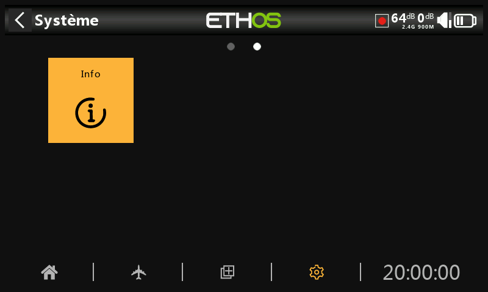
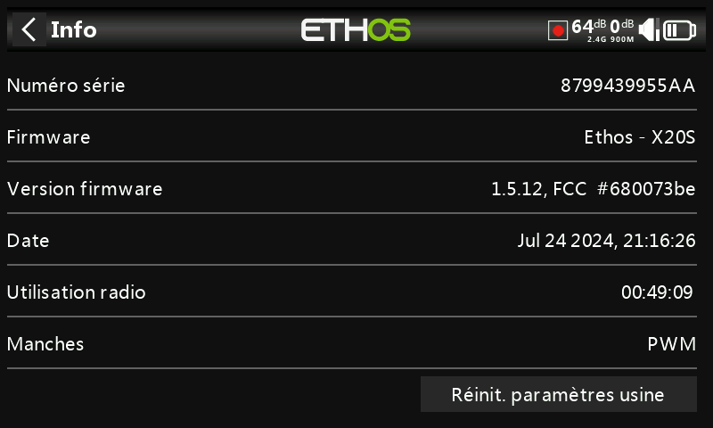
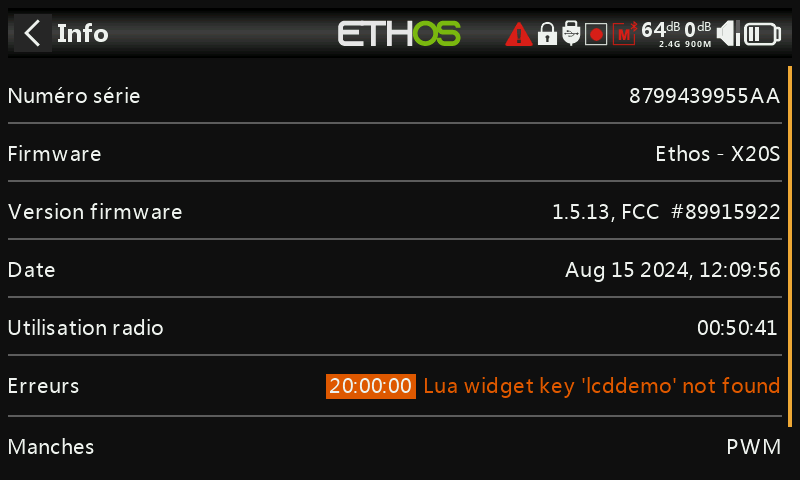
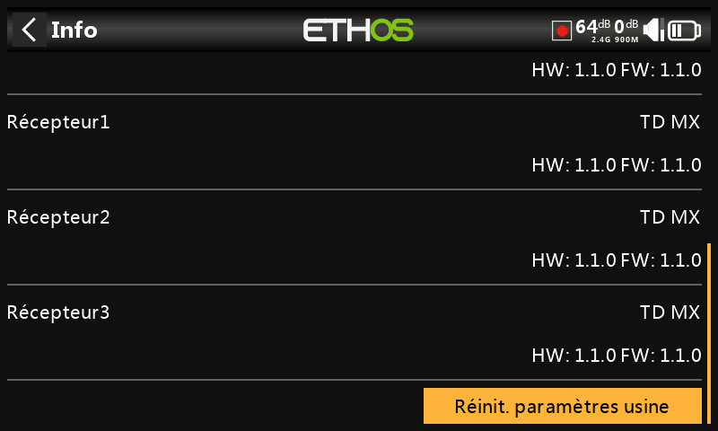
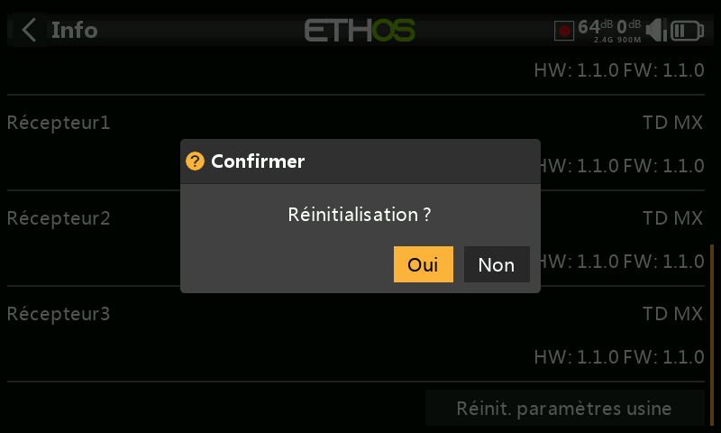

## Information

La page d'informations affiche des informations sur la version du firmware de la radio, du type de manches installés, la version du firmware du module RF interne, la version du firmware du récepteur ACCESS, TD ou TW et des informations sur le module RF externe.

NB: Ethos ne peut pas lire la version du multimodule si ce dernier est utilisé.

### Numéro de série

Numéro de série de la radio.

### Firmware

Ethos, firmware, et type de radio (par exemple X20).

### Version firmware

Version et type actuels du firmware, par exemple FCC, LBT ou Flex.

### Date

Date et heure de la version du firmware.

### Utilisation radio

Durée d'utilisation de la radio depuis la mise en service de la radio ou une réinitialisation d'usine.

### Erreurs

Lorsque Ethos détecte une erreur, un avertissement représenté par un triangle rouge s'affiche dans la barre supérieure de la vue principale.

Les erreurs peuvent être dues à :

**Erreurs de script Lua**\
Les problèmes liés au script Lua entraîneront des messages d'erreur.

**RAM backup error (erreur Mémoire de sauvegarde)**\
Chaque modèle dispose d'un espace mémoire de 32Ko qui permet de créer des modèles complexes. Le bon fonctionnement du modèle risque d'être problématique car il devra systématiquement être chargé depuis la carte SD.

**Exécution d'une version de developpement / test  du firmware (nightly)**\
Si une version de test du firmware a été installée, l'icône d'avertissement sert à rappeler que cette version n'est pas destinée à voler.

### Manches

La version capteur à effet Hall des manches installée. L'ADC est pour l'analogique.

### Module interne

Détails du module RF interne, y compris les versions du matériel et du micrologiciel.

### Récepteurs

Les détails des récepteurs liés sont affichés après le module interne. Si un récepteur redondant est lié au même emplacement que le récepteur principal, les détails du récepteur s'affichent alternativement à l'écran. L'exemple ci-dessus montre un Archer SR10 Pro et son R9MM-OTA redondant est illustré par rapport aux détails du récepteur1.

### Module externe

Détails de tout module RF FrSky externe (le cas échéant), y compris les versions du matériel et du micrologiciel si le protocole ACCESS.

NB : Les infos des multimodules ne sont pas affichées à ce jour.

### Réinitialiser paramètres usine

Permet de rétablir les paramètres d'usine de la radio. Aucune connexion USB PC n'est nécessaire.

Lorsque vous confirmez que vous souhaitez réinitialiser les paramètres d'usine, la radio efface tous les modèles, les fichiers journaux, les captures d'écran, les documents, les scripts, les bitmaps et les paramètres de la radio.

Une barre de progression est affichée pendant le processus d'effacement, puis la radio redémarre, avec les paramètres par défaut d'usine.
