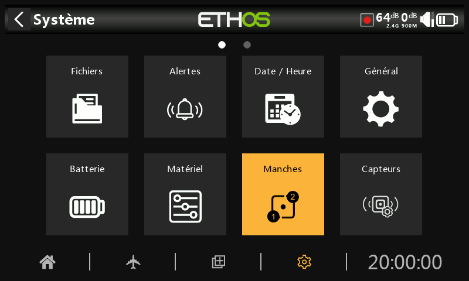
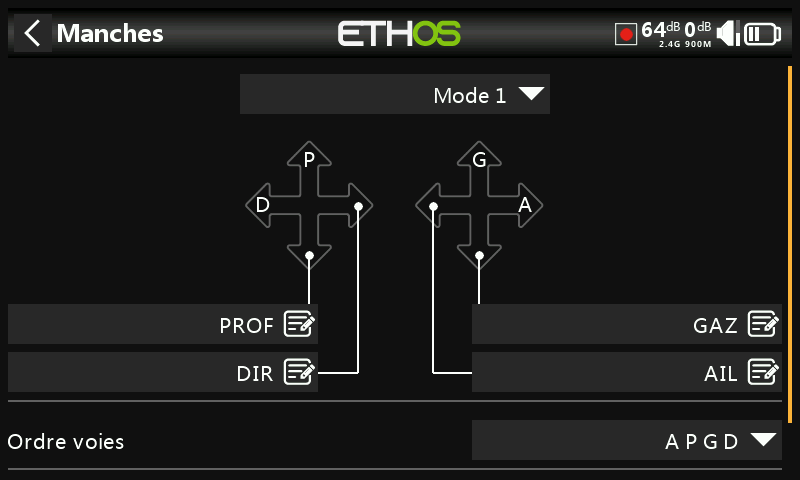
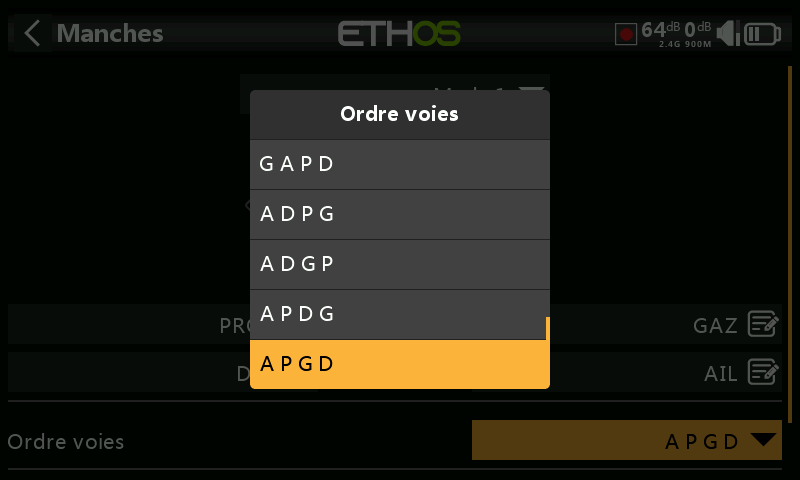

## Manches

La page "Manches" permet de sélectionner le mode des manches de la radio ainsi que l'ordre des voies:

### Mode des manches radio

Sélectionnez votre choix selon votre mode de pilotage (Mode 1 / 2 / 3 ou 4). Par défaut, les manches sont nommés selon les standards d'utilisation mais vous avez la possibilité de les renommer.
Les modes les plus courants en France sont :
		Mode 1 : Gaz / Ailerons sur le manche de droite et Profondeur / Dérive sur celui de gauche
		Mode 2 : Profondeur / ailerons sur le manche de droite et Gaz / Dérive sur celui de gauche
  
### Ordre voies

L'ordre des voies définit l'ordre dans lequel les quatre entrées des manches sont affectées aux voies dans les mixages lorsqu'un nouveau modèle est créé par l'assistant. L'ordre par défaut est APGD (AETR). S'il y en a plus d'une voie par surface, elles seront regroupées à moins que les quatre premières voies ne soient fixes, voir ci-dessous. Par exemple, pour 2 ailerons, l'ordre des voies sera AAPGD (AAETR).

### 4 premières voies fixes

Lorsque cette option est activée, le regroupement des voies ne se produit pas sur les quatre premières voies. Si l'ordre des voies est APGD (AETR), l'assistant créera un modèle adapté aux récepteurs stabilisés SRx. Par exemple, un modèle avec 2 ailerons, 1 gouverne de profondeur, 1 moteur, 1 gouvernail de direction et 2 volets sera créé avec un ordre de canal APGDAFF (AETRAFF). Si cette option n'est pas activée, l'ordre des voies sera AAPGDFF  (AAETRFF).

NB: Cette option doit généralement être activée avec l'utilisation du multimodule pour la compatibilité avec des récepteurs utilisés.
