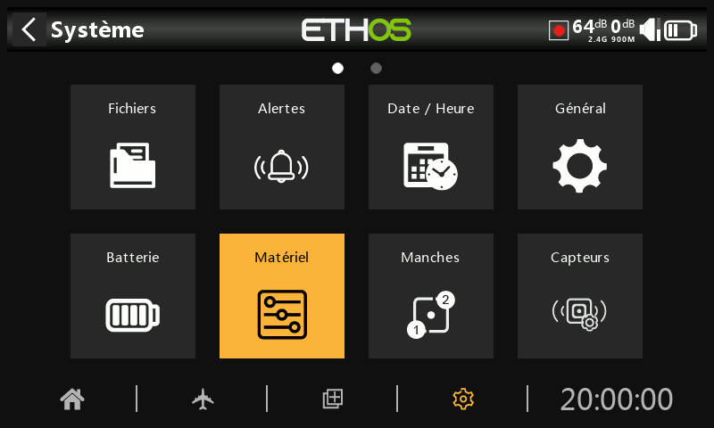

# Matériel

La section Hardware permet de tester toutes les entrées, d'effectuer l'étalonnage analogique et gyroscopique, et de définir les types de inters et la carte de la touche d'accueil.

## Vérification du matériel

La vérification du matériel permet de vérifier le fonctionnement de toutes les entrées.

Les radios X20 Pro/R/RS ont en plus les deux boutons-poussoirs à verrouillage K et L sur les épaulements arrière, ainsi que les trims supplémentaires T5 et T6 :

Les radios X18 ont également les trims supplémentaires T5 et T6 :

## Calibrage des manches et potentiomètres

L'étalonnage des analogues est effectué de manière à ce que la radio sache exactement où se trouvent les centres et les limites de chaque cardan, potentiomètre et curseur. Il est automatiquement exécuté au démarrage initial. Il doit être répété après le remplacement d'un cardan, d'un potentiomètre ou d'un curseur.

## Calibrage gyros

L'étalonnage gyroscopique peut être effectué de manière à ce que les sorties du capteur gyroscopique réagissent correctement à l'inclinaison de la radio. Il est automatiquement exécuté au démarrage initial. Par exemple, la position de « niveau » de la radio serait l'angle auquel vous tenez normalement la radio.

## Filtre analogique

Le filtre convertisseur analogique-numérique pour les manches peut être activé/désactivé avec ce réglage. La valeur par défaut est ON, ce qui peut améliorer la précision autour du neutre (centre de la course du manche). Il s'agit d'un paramètre global. Une option spécifique au modèle est disponible dans la section « Modèle / Editer le modèle » sous Filtre analogique.

## Configuration Pots / Sliders

Les potentiomètres et les curseurs peuvent être inversés, et recevoir des noms personnalisés :

Les radios X20 Pro/R/RS peuvent accueillir deux potentiomètres supplémentaires Ext1 et Ext2. Ceux-ci peuvent généralement être utilisés lors de l'installation de cardans à 3 axes.

## Configuration Inters

Le "Délai détection position centrale" garantit que la position centrale de l'interrupteur sur les interrupteurs à trois voies ne soit pas détectée lorsque l'interrupteur est basculé de la position haut à la position basse en un seul mouvement, et vice versa. Il ne doit être détecté que lorsque l'interrupteur s'arrête en position médiane. La valeur par défaut a été modifiée à 0 ms pour s'adapter aux récepteurs stabilisés FrSky lors de la détection de l'auto-vérification sur CH12.

Les inters SA à SJ peuvent être définis comme suit :

* Aucun
* Poussoirs (momentané)
* 2 positions
* 3 positions

Cela permet d'intervertir les interrupteurs, par exemple l'interrupteur momentané SH peut être échangé avec l'interrupteur à 2 positions SF. Notez qu'il peut ne pas être possible de remplacer un interrupteur momentané ou à 2 positions par un interrupteur à 3 positions si le câblage radio ne le permet pas.

Les inters peuvent également être renommés des noms par défaut SA à SJ en noms personnalisés. Notez que ces noms seront globaux pour tous les modèles.

La radio X20 Pro dispose de deux boutons-poussoirs à verrouillage supplémentaires K et L sur les épaules arrière. De plus, les positions de inter M et N peuvent être câblées à la carte de circuit imprimé, généralement utilisée pour les interrupteurs d'extrémité de manche :

## Raccourcis touches

Les touches d'accueil \[SYS] et \[MDL] et \[DISP] (TELE sur les anciens modèles) peuvent être réattribuées au gré de l'utilisateur :

* Un des écrans principaux
* N'importe quelle page du menu "Modèle"
* N'importe quelle page du menu "Système"
* La page de configuration des écrans

Pour la touche \[DISP], les options d'appui court et long peuvent être réaffectées.

Pour les touches \[SYS] et \[MDL], seules les options d'appui long peuvent être réaffectées, car une pression courte appelle respectivement la section Système ou Modèle.

## Configuration Vibreurs multiples (X20 Pro uniquement)

La X20 Pro permet d'utiliser un vibreur (par défaut) ou deux vibreurs. La choix doit être configuré ici :

La X20 Pro AW n'a pas cette option, car les 2 moteurs Haptic sont montés en usine.

## Vérif. Analogique (inspection des valeurs ADC)

Cette page affiche les valeurs de conversion analogique-numérique (CAN) pour les entrées analogiques lues par le processeur.

1. Manche gauche horizontal
2. Manche gauche vertical
3. Manche droit vertical
4. Manche droit horizontal
5. Potentiomètre 1
6. Potentiomètre 2
7. Curseur central
8. Curseur gauche
9. Curseur droit

Quelques valeurs supplémentaires sont affichées sur X20 Pro :

L'index (ADC) de la X20 Pro est le suivant :

1. Manche gauche horizontal
2. Manche gauche vertical
3. Manche droit vertical
4. Manche droit horizontal
5. Potentiomètre 1
6. Potentiomètre 2
7. Ext1 (potentiomètre externe, par ex. monté sur manche)
8. Ext1 (potentiomètre externe, par ex. monté sur manche)
9. Curseur central
10. Curseur gauche
11. Curseur droit
