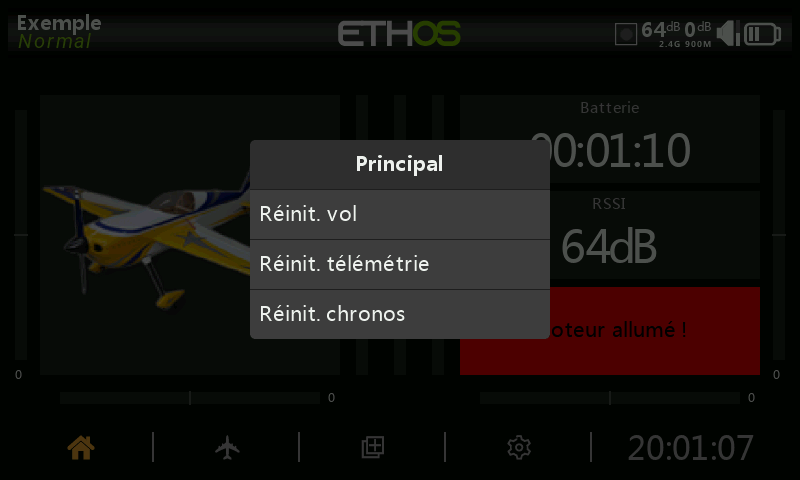
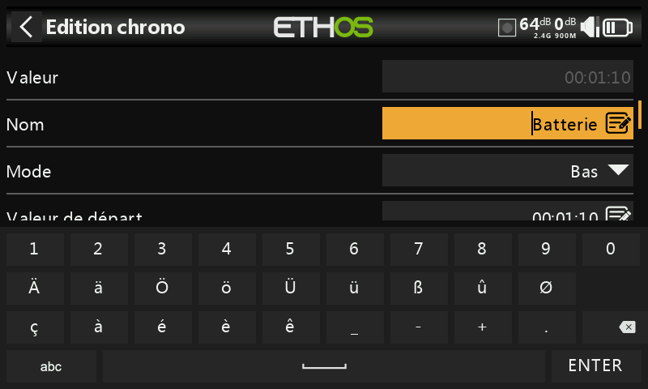

# Interface utilisateur et navigation

La radio dispose d'un écran tactile, ce qui rend l'interface utilisateur assez intuitive.&#x20;

Alternativement, le sélecteur rotatif peut être utilisé pour accéder à un champ ou au paramètre souhaité qui apparaitra en surbrillance, puis appuyez sur Entrée pour le sélectionner.

Un appui long sur la touche \[RTN] vous ramènera à l'écran d'accueil à partir de n'importe quel sous-menu.

## Menu de réinitialisation

Un appui long sur la touche \[ENT] depuis l’écran d’accueil fait apparaître un menu de réinitialisation

### **Réinitialiser le vol**

Réinitialisation des données de télémétrie, des chronos et des inters de fonction. La checklist avant vol sera systématiquement vérifier après cette réinitialisation.

### **Réinitialiser les données de télémétrie**

Réinitialisation des données de télémétrie.

### **Réinitialiser les chronos**

Réinitialisation des chronos.

## Verrouiller l'écran tactile

L'écran tactile LCD peut être verrouillé pour éviter toute opération par inadvertance, en appuyant sur \[ENTER] et \[PAGE] simultanément pendant 1 seconde à partir de l'écran d'accueil. Ce verrouillage est également accessible avec une fonction spéciale. Reportez-vous à la section correspondante

## Commandes d'édition

### **Clavier virtuel**

Ethos fournit un clavier virtuel pour l'édition des champs de texte.

Il suffit d'appuyer sur n'importe quel champ de texte (ou de cliquer sur \[ENT]) pour faire apparaître le clavier.

Appuyez sur la touche « ?123 » ou « abc » pour basculer entre les claviers alphabétiques et numériques. Le verrouillage majuscules est disponible sur le clavier alphabétique.
