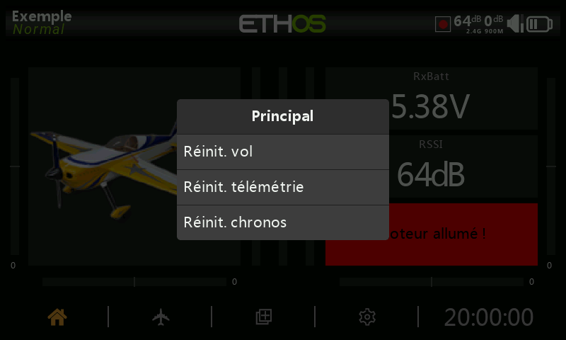
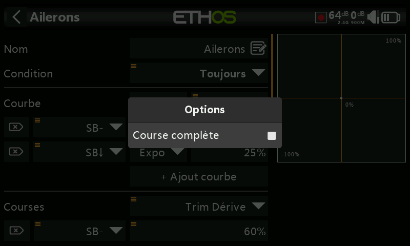
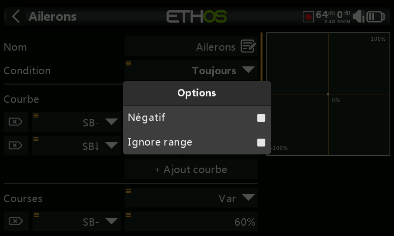

# Interface utilisateur et navigation

La radio dispose d'un écran tactile, ce qui rend l'interface utilisateur assez intuitive.&#x20;

Alternativement, le sélecteur rotatif peut être utilisé pour accéder à un champ ou au paramètre souhaité qui apparaitra en surbrillance, puis appuyez sur Entrée pour le sélectionner.

Un appui long sur la touche \[RTN] vous ramènera à l'écran d'accueil à partir de n'importe quel sous-menu.

## Menu de réinitialisation

Un appui long sur la touche \[ENT] depuis l’écran d’accueil fait apparaître un menu de réinitialisation

### **Réinitialiser le vol**

Réinitialisation des données de télémétrie, des chronos et des inters de fonction. La checklist avant vol sera systématiquement vérifier après cette réinitialisation.

### **Réinitialiser les données de télémétrie**

Réinitialisation des données de télémétrie.

### **Réinitialiser les chronos**

Réinitialisation des chronos.

## Verrouiller l'écran tactile

L'écran tactile LCD peut être verrouillé pour éviter toute opération par inadvertance, en appuyant sur \[ENTER] et \[PAGE] simultanément pendant 1 seconde à partir de l'écran d'accueil. Ce verrouillage est également accessible avec une fonction spéciale. Reportez-vous à la section correspondante

## Commandes d'édition

### Saisie de texte

Ethos fournit un clavier virtuel pour l'édition des champs de texte.

Il suffit d'appuyer sur n'importe quel champ de texte (ou de cliquer sur \[ENT]) pour faire apparaître le clavier.

Appuyez sur la touche « ?123 » ou « abc » pour basculer entre les claviers alphabétiques et numériques. Le verrouillage majuscules est disponible sur le clavier alphabétique.

### Saisie de valeurs numériques

Lorsque vous touchez une valeur numérique, une boîte de dialogue apparaît en bas de l'écran avec les commandes de valeur numérique :

1. Les touches '<' et '>' modifient la valeur du pas entre un minimum et un maximum selon le champ utilisé par incrément de facteur 10, par exemple 0,01 %, 0,1 %, 1,0 % ou 10,0 %.
2. Les touches '-' et '+' incrémentent ou décrémentent de la valeur du pas sélectionné en 1. Le sélecteur rotatif peut également être utilisé pour ajuster la valeur.
3. Le bouton « Plus » à droite offre des options supplémentaires :

* la valeur par défaut
* le minimum
* le maximum
* affichage d'un curseur pour le réglage : "Activer curseur"

Le curseur permet d'ajuster rapidement la valeur. Sélectionnez « Désactiver curseur » pour revenir aux saisies par valeurs.

Les valeurs de télémétrie peuvent être saisies de la même manière :

### Options des champs de saisie

Ethos dispose d'une fonction « Options » très puissante. Après avoir sélectionné le champ souhaité, un appui long sur la touche Entrée ou un appui long sur l'écran fera apparaître une boîte de dialogue d'options.

Les champs dotés de cette fonctionnalité peuvent être identifiés par un icône de menu (symbole hamburger) dans le coin supérieur gauche du champ :

#### Options des valeurs numériques

Dans cet exemple, vous avez un choix de courses parmis le minimum / maximum ou une source.
Le choix d'une source comme un potentiomètre par exemple permet d'ajuster la course en vol.

Dans le cas d'une utilisation d'une source, sur le champ correspondant, un appui long sur Entrée ou avec l'écran, une boîte de dialogue vous permet de convertir la valeur actuelle de la source en une valeur fixe :

#### Options des sources

Les options des sources sont disponibles en fonction du contexte :

* Inverser : permet d'annuler ou d'inverser une source telle qu'une position d'inter. Par exemple, au lieu d'être actif lorsque l'interrupteur SA est en haut, il serait actif lorsque l'interrupteur SA n'est PAS en haut, c'est-à-dire en position médiane ou basse.

* Front : si vous avez besoin d'une action unique lorsque la source passe de FAUX à VRAI ou de VRAI à FAUX. Seule le changement d'état est prise en compte, et non la valeur de l'état.

* Negatif : rend la valeur négative

* Demi-course et Course complète : ces options sont disponibles lors de l'utilisation d'un commutateur à 2 positions ou d'un commutateur logique comme source. La plage devient [0-100%] au lieu de [-100%-100%]
  

* Par défaut, les versions ont une plage de +/- 25 %. Lorsqu'il est utilisé comme source, les trims peuvent éventuellement être modifiés en plage complète +/- 100 % (appuyez longuement sur Entrée sur le trim).

* Non contrôlé par l’élève : cette option peut être définie sur les sources pour ignorer la valeur provenant de l'entrée de l’élève. Une application typique est celle où un interrupteur logique est configuré pour détecter le mouvement des manches du côté instructeur (par exemple, le manche de profondeur) afin de permettre une intervention instantanée en cas de problème. Cette option est nécessaire pour empêcher la radio élève d'activer les inters logiques.

* Ignorer la plage : certains paramètres ont des plages asymétriques, comme les paramètres Min/Max dans Sorties, qui ont des plages de (-150 % à 0 %) et (0 % à +150 %) respectivement. Lorsque vous utilisez des VAR comme source pour ajuster les paramètres Min/Max, à moins que la Var n'ait une plage identique, il sera nécessaire de définir la plage Var à ignorer pour éviter les valeurs inattendues dues à la conversion de plage.

* Mini et Maxi : prend en compte la valeur maximale ou minimale du capteur de télémétrie, à la place de la valeur en temps réel :

