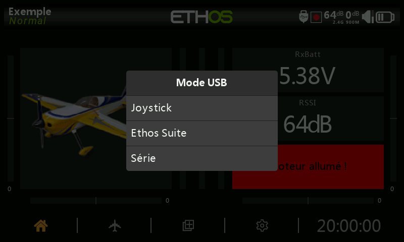

# Les différents modes de connexion USB

## Connexion USB en mode hors tension (radio éteinte)

La connexion de la radio, lorsqu'elle est éteinte, à un PC via un câble USB est le mode DFU pour flasher le bootloader (chargeur de démarrage).
La connexion via un adaptateur secteur USB-C (2A mini) charge la batterie de la radio. 

## Connexion USB en mode "bootloader"

La radio démarre en mode bootloader en allumant la radio en maintenant la touche Entrée. Le message d'état 'Bootloader' s'affiche à l'écran pour confirmer le mode bootloader..

La radio, connectée à un PC via un câble de données USB affiche « USB Connecté » et deux disques apparaissent comme lecteurs externes. Le premier correspond à la mémoire flash interne de la radio et le second au contenu de la carte SD ou eMMC.

Ce mode est utilisé pour la lecture et l'écriture de fichiers sur une carte SD ou eMMC et/ou la mémoire flash interne de la radio.

Ce mode peut également être utilisé pour se connecter à Ethos Suite afin de mettre à jour la radio. Veuillez-vous référer au mode Bootloader dans la section Ethos Suite.

## Connection USB en mode "normal"

Si la radio est connectée à un PC via un câble de données USB alors qu'elle est sous tension, la boîte de dialogue suivante s'affiche

* En mode "Joystick", la radio peut être configurée pour contrôler les simulateurs RC.
* En mode "Ethos Suite", la radio peut communiquer avec Ethos Suite (transfert de fichiers et contrôle de la radio)
* En mode "Série", la radio envoie les traces de Debug, ces traces peuvent être affichées dans Ethos Suite.

  Le choix du mode de connextion USB par défaut est disponible dans les paramètres de la radio.
